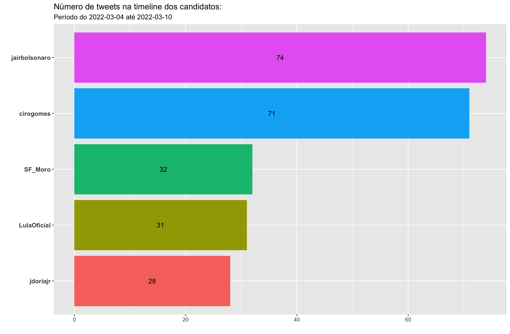
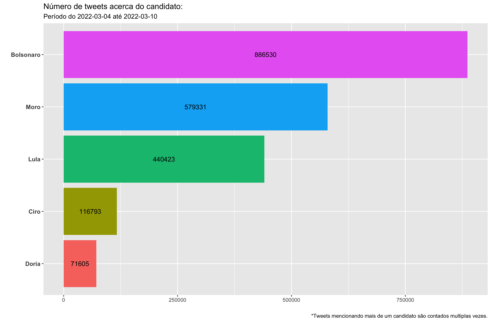
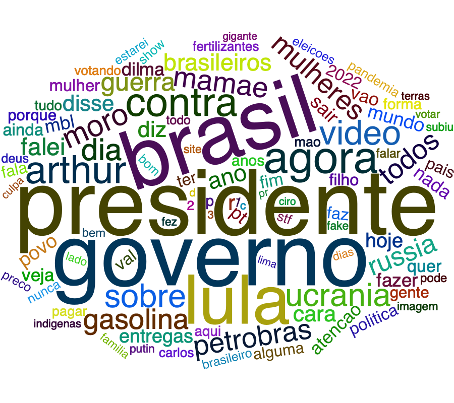
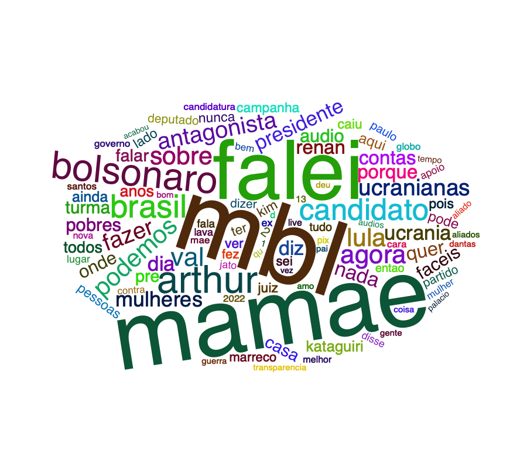
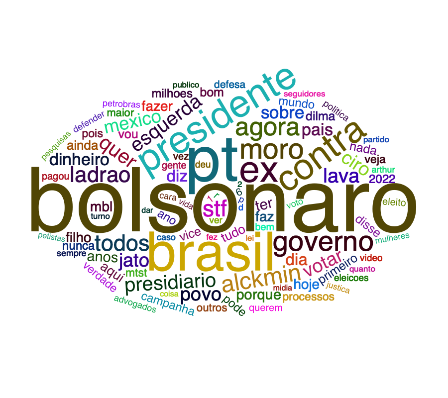
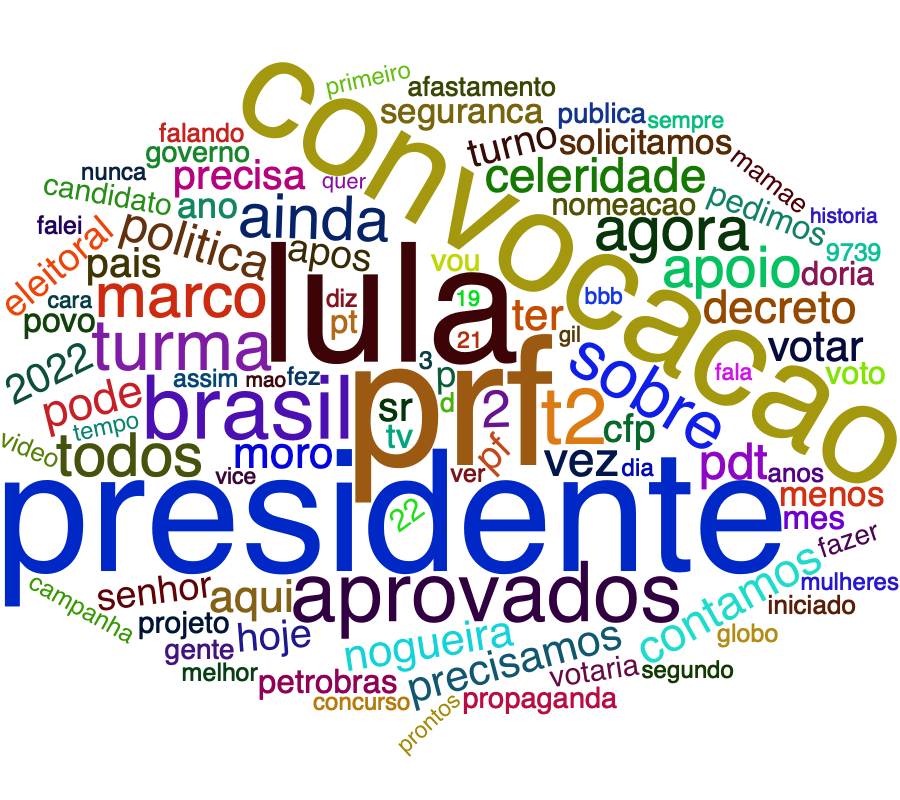
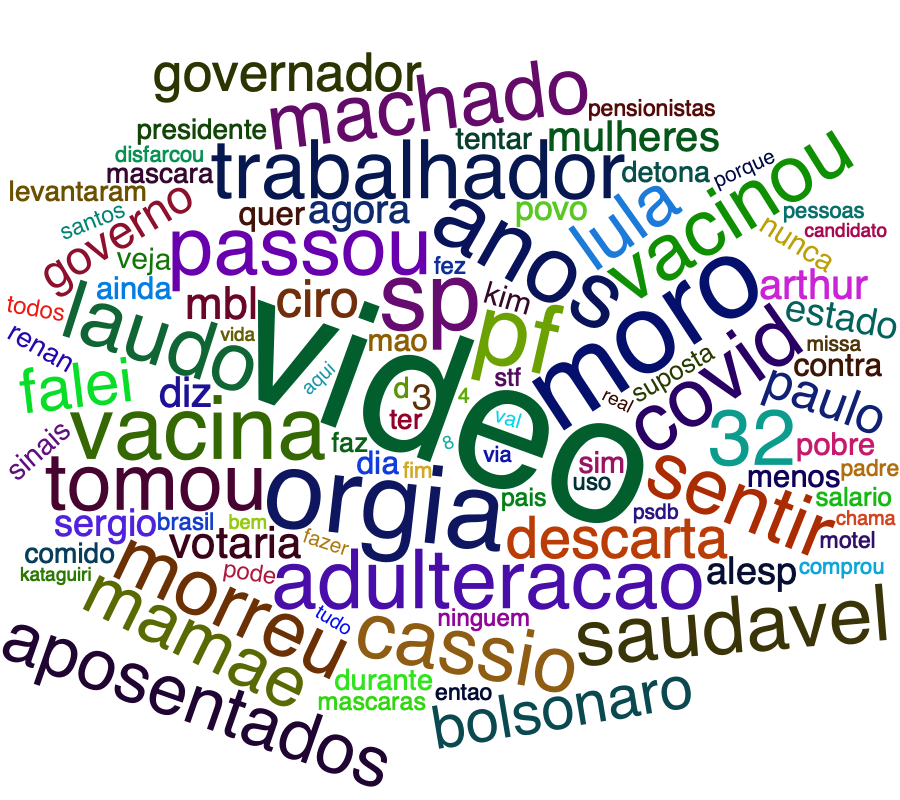

```{r setup, include=FALSE}
knitr::opts_chunk$set(echo = FALSE)
```

## Como os dados foram extraídos

Para cada candidato, foram coletados tuites referentes aos últimos 7 dias (da sexta-feira 4 de março até a quinta-feira 10 de março) totalizando, aproximadamente, 2 milhões de tweets. Os dados foram extraídos através de uma API do twitter utilizada exclusivamente para fins acadêmicos e analisados utilizando o software R. 


## Contexto geral

Cabe primeiro ressaltar a assimetria entre o número de seguidores no Twitter por candidato pesquisado nessa última semana, o que vai influenciar sobremaneira a análise dos dados.

- Bolsonaro - 7,4 milhões
- Moro - 3,3 milhões
- Lula - 3,1 milhões
- Dória - 1,5 milhões
- Ciro - 1,3 milhões

## Tuites dos candidatos

Abaixo apresentamos um gráfico com o número de tuites da timeline dos candidatos, dentre os cinco que fizeram parte de nosso levantamento: Bolsonaro, Ciro, Moro, Lula e Dória, de acordo com a frequência com que os candidatos tuitaram na última semana.

<center>
```{r echo = FALSE, out.width = "70%"}

```
</center>


## Tuites sobre os candidatos

Na sequência apresentamos em ordem decrescente (do mais citado ao menos citado), o total de tuites que mencionaram o nome de cada candidato pesquisado durante a última semana: Bolsonaro, Moro, Lula, Ciro e Dória.

<center>
```{r echo = FALSE, out.width = "70%"}

```
</center>


<aside>
Uma nuvem de palavras é uma representação gráfica das palavras mais frequentes dentro de um texto ou conjunto de textos. 
</aside>

Por fim, apresentamos abaixo cinco nuvens de palavras, onde cada uma corresponde a um candidato, é importante sinalizar que o nome de cada candidato foi retirado da sua própria nuvem para melhor visualização das palavras a ele associadas. Cabe ressaltar também, que cada nuvem reflete as 100 palavras mais relevantes associadas, excluídas stop words,  a cada candidato nas interações dos usuários do Twitter na última semana.

> Clique no nome do candidato para ver a respectiva nuvem de palavras.


```{r panelset, layout='l-page', echo=FALSE}
xaringanExtra::use_panelset()
xaringanExtra::style_panelset_tabs(foreground = "honeydew", background = "#0F2E3D")
```

::::: {.panelset}

::: {.panel}

#### Bolsonaro {.panel-name}

<center>
```{r echo = FALSE, out.width = "70%"}

```
</center>

:::

::: {.panel}

#### Moro {.panel-name}

<center>
```{r echo = FALSE, out.width = "70%"}

```
</center>

:::

::: {.panel}

#### Lula {.panel-name}

<center>
```{r echo = FALSE, out.width = "70%"}

```
</center>

:::

::: {.panel}

#### Ciro {.panel-name}

<center>
```{r echo = FALSE, out.width = "70%"}

```
</center>

:::

::: {.panel}

#### Doria {.panel-name}

<center>
```{r echo = FALSE, out.width = "70%"}

```
</center>
:::


:::::


Ao analisar as nuvens, compartilhamos a primeira impressão de cada uma:

- Bolsonaro: governo, presidente, Brasil e Lula em destaque.
- Moro: Mamãe, MBL, falei, Arthur e Bolsonaro em destaque.
- Lula: Bolsonaro, PT, Brasil, presidente e contra em destaque.
- Ciro*: presidente, Lula, PRF, convocação e Brasil em destaque.
- Dória: vídeo, orgia, Moro e vacina em destaque

> *Nos resultados relativos a Ciro, verificamos que termos como PRF e convocação estavam relacionados com uma mobilização entre os dias 8 e 9/3 relativa a um concurso de policiais rodoviários federais pedindo a convocação de candidatos. Fazendo uma busca na plataforma, encontramos tuites direcionados ao ministro da Casa Civil Ciro Nogueira, sendo captado na formação da nuvem do candidato Ciro Gomes nessa semana.

## Comentários finais

A apresentação desse conjunto de dados visa contribuir para interpretações sobre a movimentação no Twitter dos possíveis candidatos nas eleições de 2022, bem como sobre o que se fala a seu respeito nas interações dos usuários da plataforma na última semana. Esse é um trabalho de pesquisa em andamento e será aperfeiçoado no transcorrer das semanas.


