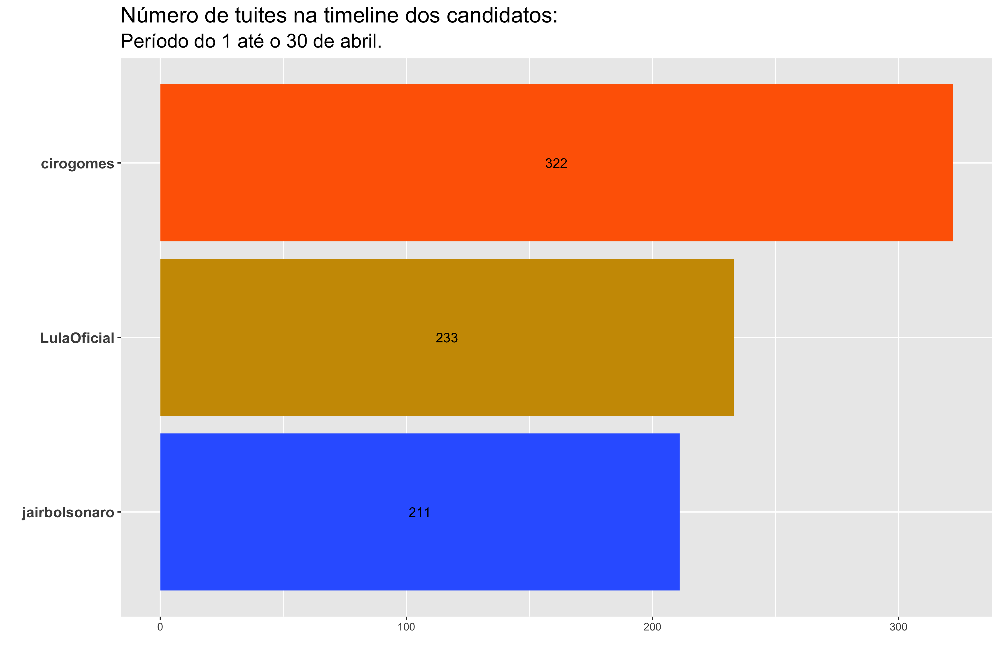
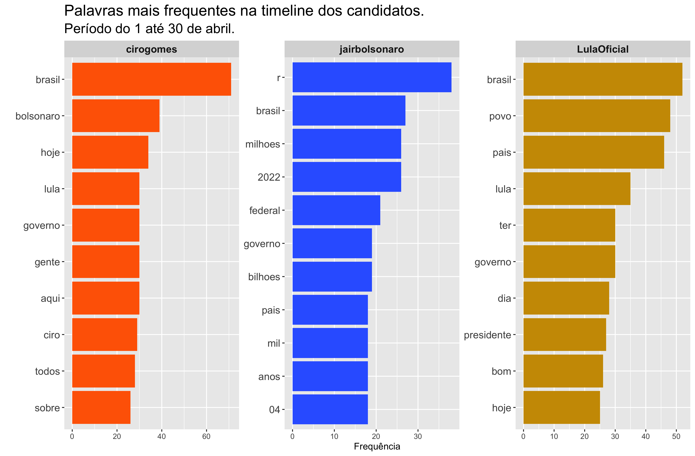
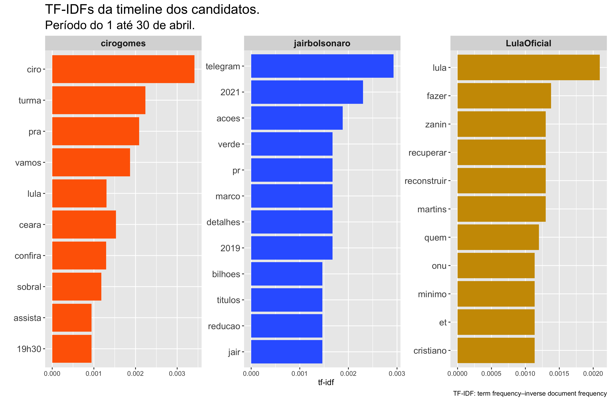
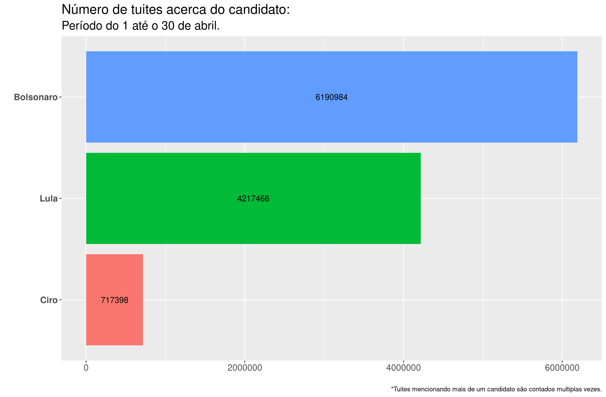
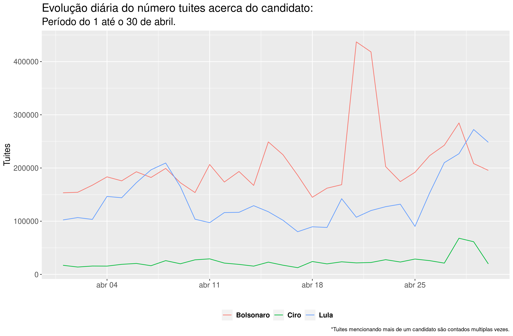
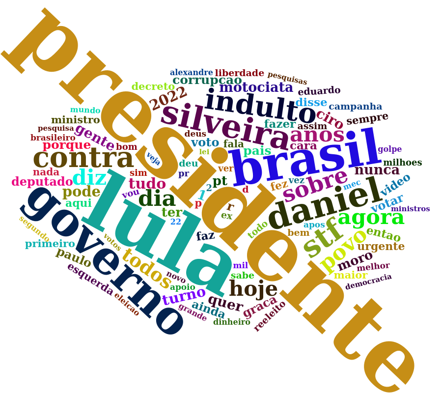
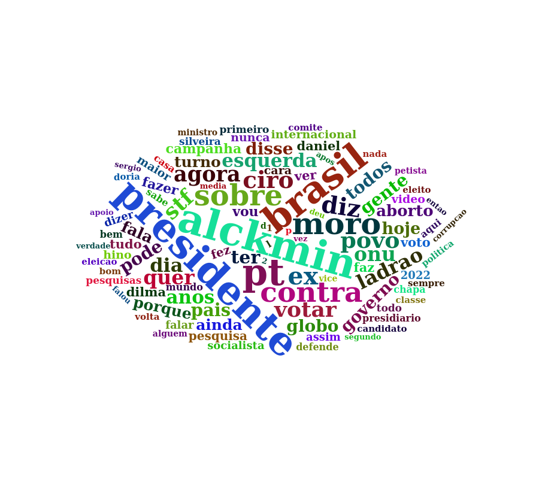
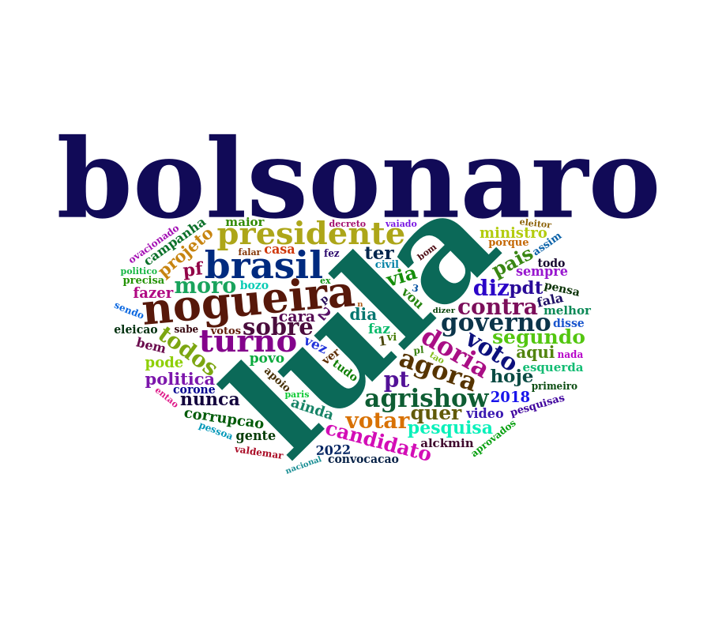

```{r setup, include=FALSE}
knitr::opts_chunk$set(echo = FALSE)
```

## Como os dados foram extraídos

Para cada candidato, foram coletados tuítes referentes a cada um dos 30 dias do mês de abril, totalizando, mais de 11 milhões de tuítes. Os dados foram extraídos através de uma API do twitter utilizada exclusivamente para fins acadêmicos e analisados utilizando o software R.

<aside>
Os autores agradecem ao Twitter pelas contas acadêmicas a eles concedidas.
</aside>


## Contexto geral

Cabe ressaltar a disparidade entre o número de seguidores no Twitter dos candidatos durante o período de análise (abril, 2022).

- Bolsonaro - 7,8 milhões
- Lula - 3,4 milhões
- Ciro - 1, 3 milhões


## Tuites dos candidatos

Na Figura 1 abaixo, apresentamos um gráfico com o número de tuites da timeline dos candidatos, dentre os três que fizeram parte de nosso levantamento: Ciro, Lula e Bolsonaro, de acordo com a frequência com que os candidatos tuitaram no mês abril.

<center>
```{r echo = FALSE, out.width = "85%", fig.cap = "Número de tuítes na timeline dos candidatos"}

```
</center>

As Figuras 2 e 3 apresentam as palavras mais frequentes nos tuítes da timeline dos candidatos e as palavras mais frequentes nos tuítes da timeline dos candidatos que não foram tão frequentes nos túites da timeline dos outros candidatos, respectivamente.

<center>
```{r echo = FALSE, out.width = "100%", fig.cap = "Palavras mais frequentes na timeline dos candidatos"}

```
</center>

A análise das palavras mais frequentes nos tuites da timeline dos candidatos nos permite apresentar um panorama dominante dos assuntos por eles tratados. Enquanto o perfil de Bolsonaro dá destaque aos feitos do governo, em especial os gastos em reais (r) expressos em cifras de milhões e bilhões, o perfil de Lula dá destaque ao povo e traz uma chave positiva, com o termo “bom”. Já o perfil de Ciro, se preocupa em mencionar nominalmente os outros dois candidatos. Por fim, o termo governo é tema comum ao perfil dos três candidatos.


<center>
```{r echo = FALSE, out.width = "100%", fig.cap = "TF-IDF da timeline dos candidados"}

```
</center>


TF-IDF (*term frequency-inverse document frequency*) reflete a frequência das palavras nos tuites da timeline dos candidatos que não são tão frequentes para os três candidatos em geral. Assim:

- O perfil de Lula se destaca pelas ações propositivas, através da ênfase dada ao uso de verbos como “fazer, recuperar, reconstruir”.
- O perfil de Bolsonaro apresenta como especificidade o “Telegram”, e a menção a “ações, bilhões e títulos”, bem como a ênfase em “redução”, procurando comparar o que seu governo realizou entre 2019 e 2021. 
- No perfil de Ciro, a ênfase é dada ao Ceará e Lula. 
- Vale acrescentar que os três perfis falam das pessoas em si dos candidatos. Ou seja, Lula e Ciro aos nomes diretamente, e Bolsonaro através das referências a “Jair” e “pr”. 


Ainda a título de últimas observações, os palavras “ONU, zanin e cristiano” figuram nas menções do perfil de Lula, associadas à decisão do Comitê de Direitos Humanos da ONU sobre sua sentença na Lava Jato.  É importante também mencionar que *et* no perfil do Lula, refere-se à palavra em francês *et* (que significa "e") quando tuítes na timeline do candidato são postados em francês. Por último, a alta frequência observada no termo "19h30" na timeline do candidato Ciro Gomes, faz referência à live “Ciro Games” que acontece nesse horário.


## Tuites sobre os candidatos


Na sequência apresentamos em ordem decrescente (do mais citado ao menos citado), o total de tuítes que mencionaram o nome de cada candidato pesquisado durante a última semana: Bolsonaro, Lula e Ciro.


<aside>
Para coletar os tuítes mencionando os respectivos candidatos, foram utilizados como critério de busca as palavras "Bolsonaro", "Ciro" e "Lula".
</aside>

<center>
```{r echo = FALSE, out.width = "85%", fig.cap = "Total de tuítes sobre os candidatos"}

```
</center>

É importante mencionar que, devido ao critério de busca utilizado e como será apresentado posteriormente, os tuítes referentes ao candidato Ciro Gomes incluem também tuítes referentes ao Ministro da Casa Civil, Ciro Nogueira. Apesar disso, o número de tuítes sobre Ciro Gomes é menor do que a oitava parte do número de tuítes referentes ao candidato Jair Bolsonaro e menor do que a quinta parte do número de tuítes referentes ao candidato Luiz Lula. A cada três tuites falando de Bolsonaro, dois falam de Lula; nesse sentido, as interações envolvendo o nome de Ciro não parecem ser relevantes.


<center>
```{r echo = FALSE, out.width = "85%", fig.cap = "Evolução diária da quantitate de tuítes sobre os candidatos"}

```
</center>

A Figura 4, apresenta a evolução diária do número de tuítes a respeito dos candidatos. A superioriedade do número de tuítes do Lula e Bolsonaro, sobre o número de tuítes de Ciro é indiscutível e persiste ao longo do mês inteiro. Por outro lado, embora o número de tuítes a respeito de Bolsonaro é, em geral, superior ao número de tuítes sobre o candidato Lula, existem 2 períodos do tempo em que o número de tuítes do Lula supera o número de tuítes acerca do Bolsonaro.

### Núvem de palavras


Por fim, apresentamos abaixo três nuvens de palavras, onde cada uma corresponde a um candidato. É importante sinalizar que o nome de cada candidato foi retirado da sua própria nuvem, para melhor visualização das palavras a ele associadas. Cabe ressaltar também, que cada nuvem reflete as 100 palavras mais relevantes associadas, excluídas _stop words_, a cada candidato nas interações dos usuários do Twitter no último mês de abril.


<aside>
Uma nuvem de palavras é uma representação gráfica das palavras mais frequentes dentro de um texto ou conjunto de textos. 
</aside>

> Clique no nome do candidato para ver a respectiva nuvem de palavras.


```{r panelset, layout='l-page', echo=FALSE}
xaringanExtra::use_panelset()
xaringanExtra::style_panelset_tabs(foreground = "honeydew", background = "#0F2E3D")
```

::::: {.panelset}

::: {.panel}

#### Bolsonaro {.panel-name}

<center>
```{r echo = FALSE, out.width = "70%"}

```
</center>

:::

::: {.panel}

#### Lula {.panel-name}

<center>
```{r echo = FALSE, out.width = "70%"}

```
</center>

:::

::: {.panel}

#### Ciro {.panel-name}

<center>
```{r echo = FALSE, out.width = "70%"}

```
</center>

:::

:::::


Ao analisar as nuvens, compartilhamos a primeira impressão de cada uma:


- **Bolsonaro:** em primeiro plano as palavras “presidente”, “Brasil”, “Lula” e "governo''; em segundo plano, “indulto”, “Daniel” e “Silveira”, que se associam a “STF”, “povo”, e a palavra “contra”; em terceiro plano, vem “motociata”, “corrupção”, “voto” e “PT”.  Pode-se destacar que, dentre os candidatos investigados, a nuvem de Bolsonaro é mais dispersa e apresenta menos substantivos.
- **Lula:** em primeiro plano e em igual equivalência aparecem “presidente”, “Alckmin”, “Brasil” e “PT”;  em segundo plano “Moro”, “sobre” e “contra”;  em terceiro plano, “agora”, “diz”, “Ciro”, “povo”, “ONU”, “ladrão” e “votar”. Pode-se destacar que a nuvem de Lula possui maior densidade na frequência observada das palavras, sejam elas verbos, substantivos ou adjetivos, quando comparada às demais.
- __Ciro*:__ em primeiro plano, de modo isolado, destacam-se as referências a “Lula” e “Bolsonaro”; em segundo plano, “Nogueira”, “Brasil”, “turno” e “presidente”; em terceiro plano “agrishow”, “agora”, “votar”, voto”, “PT”, “Doria”, “governo”, “contra” e “diz”. 

> *Fazendo uma busca na plataforma, encontramos tuites direcionados ao ministro da Casa Civil Ciro Nogueira, sendo captados na formação da nuvem do candidato Ciro Gomes nesse mês de abril.


## Comentários finais

A apresentação desse conjunto de dados visa contribuir para interpretações sobre a movimentação no Twitter dos possíveis candidatos nas eleições de 2022, bem como sobre o que se fala a seu respeito nas interações dos usuários da plataforma no mês de abril. Esse é um trabalho de pesquisa em andamento e será aperfeiçoado no transcorrer dos meses até a eleição de 2022.

