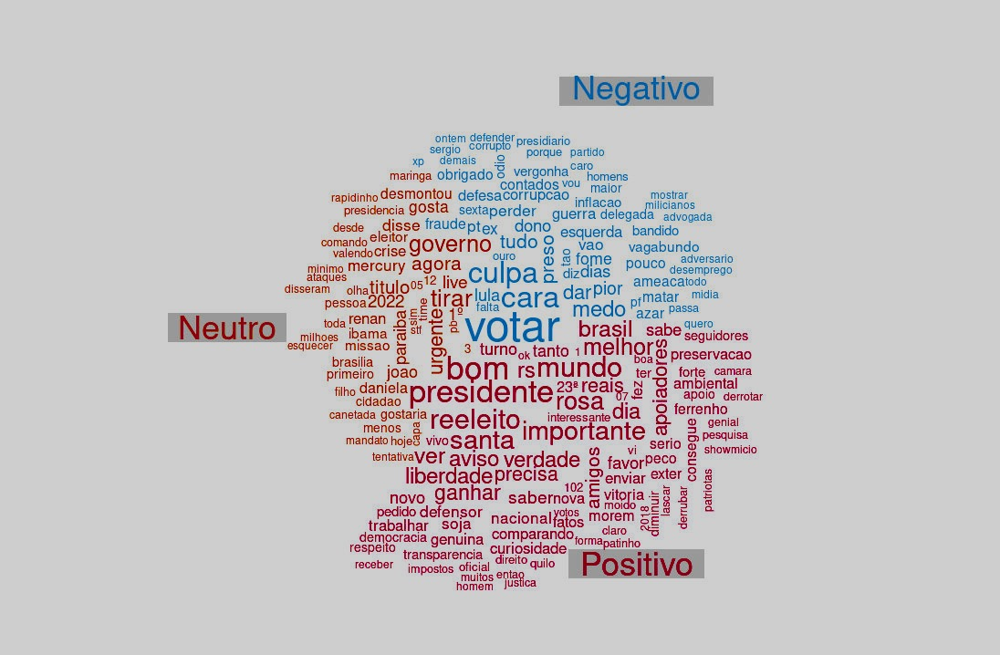

```{r setup, include=FALSE}
knitr::opts_chunk$set(echo = FALSE)
```

## Como os dados foram extraídos

Para cada candidato, foram coletados tuítes referentes a cada um dos primeiros 15 dias do mês de maio, totalizando mais de 7 milhões de tuítes. Os dados foram extraídos através de uma API do twitter utilizada exclusivamente para fins acadêmicos e analisados utilizando o software R.

<aside>
Os autores agradecem ao Twitter pelas contas acadêmicas a eles concedidas.
</aside>

## Número de seguidores

A seguir, apresentamos o número atualizado (maio, 2022) de seguidores no Twitter de cada um dos candidatos. 

- **Bolsonaro** - 8 milhões (acréscimo de 2,5% de seguidores em relação ao boletim anterior)
- **Lula** - 3,5 milhões ( acréscimo de 2,9% de seguidores em relação ao boletim anterior)
- **Ciro** - 1,3 milhões (não foi verificada alteração)


## Tuítes dos candidatos

Na Figura 1 abaixo, apresentamos um gráfico com o número de tuítes da timeline dos candidatos, dentre os três que fizeram parte de nosso levantamento: Ciro, Lula e Bolsonaro, de acordo com a frequência com que os candidatos tuitaram na primeira quinzena do mês de maio.

<center>
```{r echo = FALSE, out.width = "85%", fig.cap = "Número de tuítes na timeline dos candidatos"}

```
</center>


As Figuras 2 e 3 apresentam as palavras mais frequentes nos tuítes da timeline dos candidatos e as palavras mais frequentes nos tuítes da timeline dos candidatos que não foram tão frequentes nos tuítes da timeline dos outros candidatos, respectivamente.


<center>
```{r echo = FALSE, out.width = "100%", fig.cap = "Palavras mais frequentes na timeline dos candidatos"}

```
</center>


<center>
```{r echo = FALSE, out.width = "100%", fig.cap = "TF-IDF da timeline dos candidados"}

```
</center>


A análise das palavras mais frequentes nos tuítes da timeline dos candidatos (Figura 2) nos permite apresentar um panorama dominante dos assuntos por eles tratados. No perfil de Bolsonaro é possível apontar uma continuidade, em relação ao mês de abril, com destaque aos feitos do governo, em especial, aos gastos em reais (r) expressos em cifras de milhões. A novidade surge na menção ao termo “impostos” associado a essas cifras. Já o perfil de Lula traz em destaque palavras como país, Brasil, povo, todos, pessoas e o enfoque no momento de “hoje”. No perfil de Ciro, se mantém a preocupação em mencionar nominalmente os outros dois candidatos, mas na primeira quinzena de maio, é possível notar menções ao povo, hoje, Brasil, gente e Petrobrás. Por fim, o termo Brasil é uma menção comum observável no perfil dos três candidatos.
 
Na Figura 3, TF-IDF (term frequency-inverse document frequency) reflete a frequência das palavras nos tuites da timeline dos candidatos que não são tão frequentes para os três candidatos em geral. Assim:
 
- No perfil de Lula, há uma continuidade nas ações propositivas com mais qualificações, através da ênfase dada ao uso de verbos como “defender, ter, recuperar, reconstruir, estudar e cuidar”. Surgem novos substantivos como “soberania” e “universidades”.

- O perfil de Bolsonaro apresenta em destaque os termos “impostos”, “contratação”, “medidas” e “entrega”. A referência ao ano de 2019 se mantém em relação ao encontrado em abril.

- No perfil de Ciro, a ênfase é dada às ações como “assista” e “participe”, e aos termos “debate”, “Leonel”. 


## Tuítes sobre os candidatos


Na sequência, na Figura 4, apresentamos em ordem decrescente (do mais citado ao menos citado), o total de tuítes que mencionaram o nome de cada candidato pesquisado na primeira quinzena do mês de maio: Lula, Bolsonaro e Ciro.

<aside>
Para coletar os tuites mencionando os respectivos candidatos, foram utilizados como critério de busca as palavras "Bolsonaro", "Ciro" e "Lula". Tuítes mencionando "Ciro Nogueira" foram excluidos das análises referentes ao candidato Ciro.
</aside>

<center>
```{r echo = FALSE, out.width = "85%", fig.cap = "Total de tuítes sobre os candidatos"}

```
</center>


Para coletar os tuítes mencionando os respectivos candidatos, foram utilizados como critério de busca as palavras “Lula”, “Bolsonaro” e “Ciro”. Em relação ao mês de abril, se reverteu a tendência anterior. É possível destacar que no mês de maio às menções a Lula ultrapassam o número de menções a Bolsonaro, no universo do que foi observado na rede social Twitter.


Na evolução diária do número de tuítes (Figura 5), pode-se observar que, à exceção dos dias 3 e 5, o número de menções a Lula é superior ao número de menções a Bolsonaro, na primeira semana do mês. Já na segunda semana, apenas nos dias 8 e 11 este mesmo fenômeno acontece, sendo observado o aumento no número de tuítes com menções a Bolsonaro, se considerado Lula, mas com uma distância inferior à observada na primeira semana. 


<center>
```{r echo = FALSE, out.width = "85%", fig.cap = "Evolução diária da quantitate de tuítes sobre os candidatos"}

```
</center>


### Nuvem de palavras


<aside>
Uma nuvem de palavras é uma representação gráfica das palavras mais frequentes dentro de um texto ou conjunto de textos. 
</aside>

A seguir, apresentamos três nuvens de palavras, onde cada uma corresponde a um candidato. É importante sinalizar que o nome de cada candidato foi retirado da sua própria nuvem, para melhor visualização das palavras associadas. Cabe ressaltar também, que cada nuvem reflete as 100 palavras mais relevantes associadas, excluídas stop words, a cada candidato nas interações dos usuários do Twitter nos últimos quinze dias do mês de abril.


_Clique no nome do candidato para ver a respectiva nuvem de palavras._

<aside>
Em análise de texto, _stop words_ são palavras bastante comuns tais como "e", "de", "o", etc. Essas palavras não são úteis para as análises e costumam ser removidas antes das análises.
</aside>


```{r panelset, layout='l-page', echo=FALSE}
xaringanExtra::use_panelset()
xaringanExtra::style_panelset_tabs(foreground = "honeydew", background = "#0F2E3D")
```

::::: {.panelset}

::: {.panel}

#### Bolsonaro {.panel-name}

<center>
```{r echo = FALSE, out.width = "70%", fig.cap = "Nuvem de Palavras do Bolsonaro"}

```
</center>

:::

::: {.panel}

#### Lula {.panel-name}

<center>
```{r echo = FALSE, out.width = "90%", fig.cap = "Nuvem de Palavras do Lula"}

```
</center>

:::

::: {.panel}

#### Ciro {.panel-name}

<center>
```{r echo = FALSE, out.width = "80%", fig.cap = "Nuvem de Palavras do Ciro"}

```
</center>

:::

:::::


Ao analisar as nuvens, compartilhamos a primeira impressão de cada uma:

- **Bolsonaro:** em primeiro plano, as palavras “presidente”, “Brasil”, “Lula” e “governo’’ se mantiveram sem alterações. Em segundo plano, “agora”, “contra”, “sobre”, “povo”, “hoje”; e, em terceiro plano, vem “primeiro”, “turno”, “eleições”, “Moraes”, “2022” e “todos” . 
- **Lula:** em primeiro plano aparecem “presidente” e “Brasil”; em segundo plano “time”, “PT”, “povo”, “campanha”, “gente”, “turno”, “sobre”; em terceiro plano, “Daniela”, “Mercury”, “Alckmin”, “ex”, “capa” e “votar”. Vale observar que a menção à palavra “capa” ocorre na semana em que o ex-presidente Lula é capa da revista Time.
- **Ciro:** a tendência se manteve em primeiro plano, de modo isolado, destacam-se as referências a “Lula” e “Bolsonaro”; em segundo plano, “turno”, “Brasil”, “votar” e “voto”; em terceiro plano “coco”, “bambu”, “Doria”, “voto”, “primeiro”, “segundo” e “pesquisa”. 


### Análise de sentimentos


O sentimento de cada tuíte foi construído através da identificação dos sentimentos das unidades básicas (as palavras) utilizando os dicionários oplexicon v3.0 e sentilex, do pacote lexiconPT. Assim, cada palavra encontrada nos dicionários recebe a nota 1, -1 ou 0, a depender de se o sentimento for positivo, negativo ou neutro, respectivamente. Palavras não encontradas nos dicionários recebem também nota 0. Os valores atribuídos a cada palavra dentro do tuíte foram somados, e a depender do resultado positivo, negativo ou zero, o sentimento do tuíte é classificado como positivo, negativo ou neutro.
Na Figura 9 são apresentados os sentimentos (Negativo, Neutro e Positivo) percentualmente por candidato. É possível destacar um equilíbrio entre os sentimentos expressos nos tuítes dos três candidatos. Tais dados serão acompanhados ao longo do tempo comparativamente. Esse é um retrato, um instantâneo sentimental da primeira quinzena de maio.


<center>
```{r echo = FALSE, out.width = "85%", fig.cap = "Sentimentos dos tuítes por candidato"}
knitr::include_graphics("Tweets_sentimentos_candidatos_maio1.png")
```
</center>


A seguir, é possível observar a nuvem de palavras de cada um dos candidatos, apresentadas em separado, segundo os sentimentos atribuídos a cada tuíte. Palavras em verde aparecem nos tuítes classificados como associados a sentimentos positivos, palavras em vermelho aparecem nos tuítes classificados como associados a sentimentos negativos, e palavras em amarelo aparecem nos tuítes classificados como neutros.


::::: {.panelset}

::: {.panel}

#### Bolsonaro {.panel-name}

<center>
```{r echo = FALSE, out.width = "100%", fig.cap = "Nuvem de Palavras do Bolsonaro com sentimentos."}

```
</center>

:::

::: {.panel}

#### Lula {.panel-name}

<center>
```{r echo = FALSE, out.width = "100%", , fig.cap = "Nuvem de Palavras do Lula com sentimentos."}

```
</center>

:::

::: {.panel}

#### Ciro {.panel-name}

<center>
```{r echo = FALSE, out.width = "100%", fig.cap = "Nuvem de Palavras do Ciro com sentimentos."}

```
</center>

:::

:::::


- **Bolsonaro:** Os tuítes relacionados ao candidato Bolsonaro que foram classificados como associados a sentimentos positivos estão caracterizados por palavras como bom, presidente, reeleito e santa, entre outros. Já os tuites classificados como associados a sentimentos negativos são caracterizados por palavras como votar, culpa, cara, medo,, etc. Por último, tuítes considerados como neutros são caracterizados por palavras como tirar, governo e urgente.
- **Lula:** Os tuítes relacionados ao candidato Lula que foram classificados como associados a sentimentos positivos estão caracterizados por palavras como segurança, importante, favor, bom, mundo, voto, etc. Já os tuítes classificados como negativos estão caracterizados por palavras como votar, cara, culpa, XP, dar, medo. Por último, os tuítes com sentimento neutro estão caracterizados por palavras como showmício, candidatura, Daniela, Mercury, mesma.
- **Ciro:** Os tuítes relacionados ao candidato Ciro que foram classificados como associados a sentimentos positivos estão caracterizados por palavras como Doria, sabe, melhor, votar, Coco, etc. Já os tuítes classificados como negativos estão caracterizados por palavras como Bolsonaro, votar, cara, como, vagabundo, etc. Por último, os tuítes com sentimento neutro estão caracterizados por palavras como Lula, Tebet, emplacou, bolsonaro, entre outras.


## Comentários finais

A apresentação desse conjunto de dados visa contribuir para interpretações sobre a movimentação no Twitter dos possíveis candidatos nas eleições de 2022, bem como sobre o que se fala a seu respeito nas interações dos usuários da plataforma na primeira quinzena do mês de maio. Esse é um trabalho de pesquisa em andamento e será aperfeiçoado no transcorrer dos meses até a eleição de 2022.


