## Como os dados foram extraídos

Para cada candidato, foram coletados tuítes referentes a cada um dos 31 dias do mês de maio, totalizando mais de 13 milhões de tuítes. Os dados foram extraídos através de uma API do twitter utilizada exclusivamente para fins acadêmicos e analisados utilizando o software R.


<aside>
Os autores agradecem ao Twitter pelas contas acadêmicas a eles concedidas.
</aside>

## Número de seguidores

A seguir, apresentamos o número atualizado (maio em relação a abril, dados de 15 de junho de 2022) de seguidores no Twitter de cada um dos candidatos.

- **Bolsonaro**-  de 7,8 para 8,2 milhões (acréscimo de 5,1% de seguidores em relação ao mês anterior)
- **Lula**- de 3,4 para 3,6 milhões ( acréscimo de 5,9% de seguidores em relação ao mês anterior)
- **Ciro**- 1,3 milhões (não foi verificada alteração)


## Tuítes dos candidatos

Na Figura 1 abaixo, apresentamos um gráfico com o número de tuítes da timeline dos candidatos, dentre os três que fazem parte de nosso levantamento: Ciro, Lula e Bolsonaro, de acordo com a frequência com que os candidatos tuitaram no mês de maio.


<center>
```{r echo = FALSE, out.width = "85%", fig.cap = "Número de tuítes na timeline dos candidatos"}
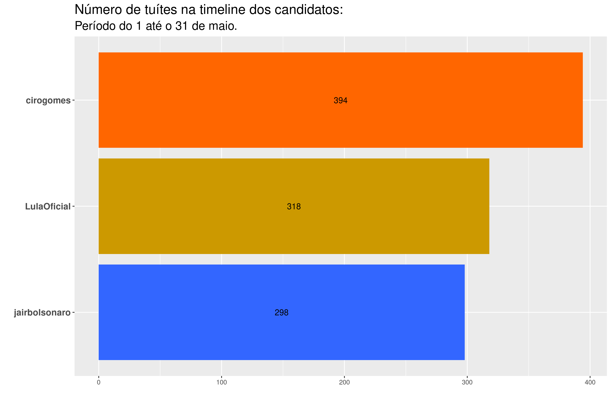
```
</center>


As Figuras 2 e 3 apresentam as palavras mais frequentes nos tuítes da timeline dos candidatos, e as palavras mais frequentes nos tuítes da timeline dos candidatos que não foram tão frequentes nos tuítes da timeline dos outros candidatos, respectivamente.


<center>
```{r echo = FALSE, out.width = "100%", fig.cap = "Palavras mais frequentes na timeline dos candidatos"}
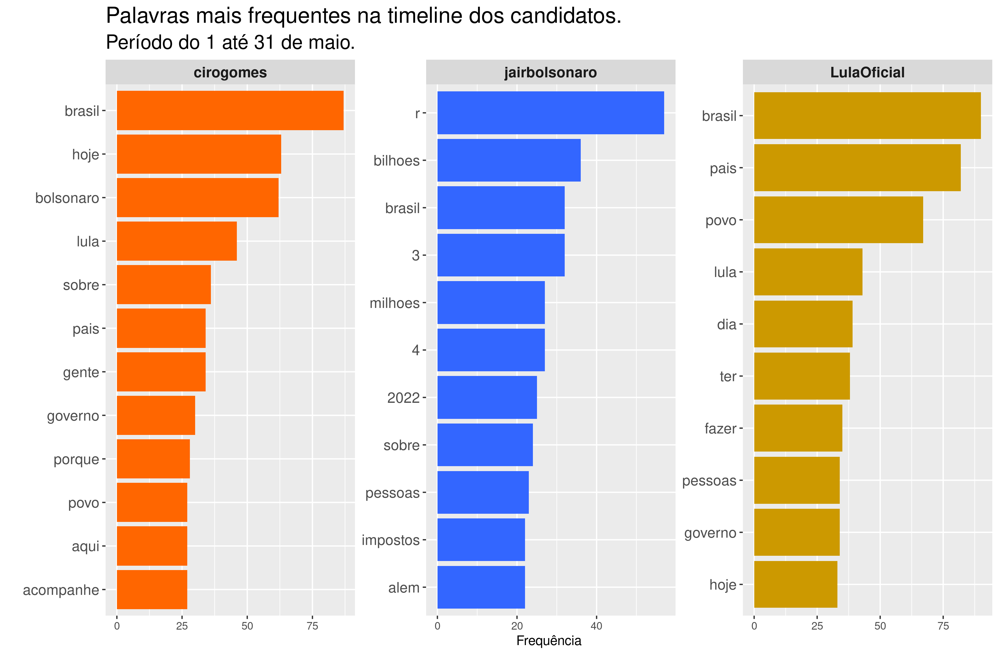
```
</center>

A análise das palavras mais frequentes nos tuítes da timeline dos candidatos (Figura 2) nos permite apresentar um panorama dominante dos assuntos por eles tratados. No perfil de Bolsonaro é possível apontar uma continuidade, em relação ao mês de abril, com destaque aos feitos do governo, em especial, aos gastos em “reais (r)” expressos em cifras de “bilhões” e “milhões”. A novidade consolidada em relação ao mês de abril surge na menção ao termo “impostos” associado a essas cifras. Já o perfil de Lula traz em destaque palavras como “país”, “Brasil”, “povo”, “todos”, “pessoas” e o enfoque no momento de “hoje”. No perfil de Ciro, se mantém a preocupação em mencionar nominalmente os outros dois candidatos, e é possível notar também, no consolidado do mês, as menções ao “povo”, “hoje”, “Brasil”, “gente” e “acompanhe”. Por fim, o termo “Brasil” é uma menção comum observável no perfil dos três candidatos.


<center>
```{r echo = FALSE, out.width = "100%", fig.cap = "TF-IDF da timeline dos candidados"}
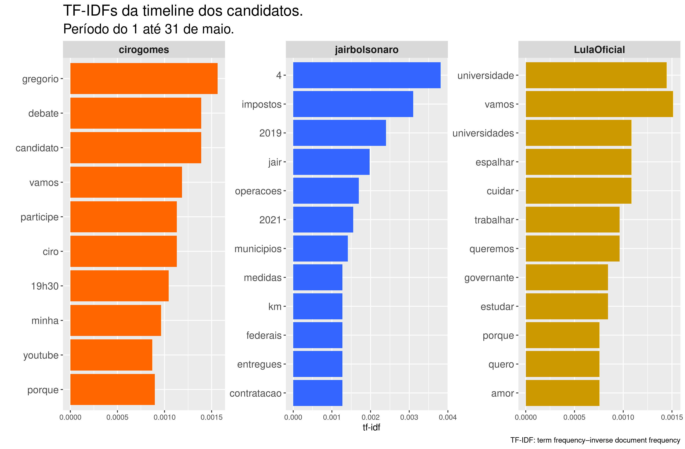
```
</center>

Na Figura 3, TF-IDF (term frequency-inverse document frequency) reflete a frequência das palavras nos tuites da timeline dos candidatos, que não são tão frequentes para os três candidatos em geral. Assim:

- No perfil de Lula, há uma continuidade nas ações propositivas com mais qualificações, através da ênfase dada ao uso de verbos como “espalhar”, “cuidar”, “estudar”, “trabalhar” e “queremos”. Surgem novos substantivos como “amor”, “universidade” e “universidades”. Interessante destacar que os dois termos, no singular e plural foram o assunto predominante no mês.
- O perfil de Bolsonaro apresenta em destaque os termos “impostos”, “contratação”, “medidas”, “federais”, “km”  e “entregues”, termos característicos dos feitos do governo em curso. A referência ao ano de “2019” se mantém em relação ao encontrado em abril, a novidade é a menção ao ano de “2021” e ao número “4”.
- No perfil de Ciro, a ênfase é dada às palavras “gregorio”, “debate” e “candidato” (referindo-se ao debate entre o candidato e Gregório Duvivier que aconteceu na segunda metade do mês de maio). As últimas palavras mencionadas (“vamos”, “participe”, “porque”, “minha”, “youtube” e “19:30”) fazem referência à live Ciro Games proferida pelo candidato toda terça-feira às 19:30 hrs.

> Em geral, pode-se observar que os tuítes do Bolsonaro centram-se nas ações realizadas durante seu governo em curso. Já os tuítes do Lula focam-se nas ações propositivas como candidato. Por último, os tuítes do Ciro destacam os recentes acontecimentos envolvendo o candidato. 


## Tuítes sobre os candidatos


Na sequência, na Figura 4, apresentamos em ordem decrescente (do mais citado ao menos citado), o total de tuítes que mencionaram o nome de cada candidato pesquisado na primeira quinzena do mês de maio: Bolsonaro, Lula e Ciro.


<aside>
Para coletar os tuites mencionando os respectivos candidatos, foram utilizados como critério de busca as palavras "Bolsonaro", "Ciro" e "Lula". Tuítes mencionando "Ciro Nogueira" foram excluidos das análises referentes ao candidato Ciro.
</aside>

<center>
```{r echo = FALSE, out.width = "85%", fig.cap = "Total de tuítes sobre os candidatos"}
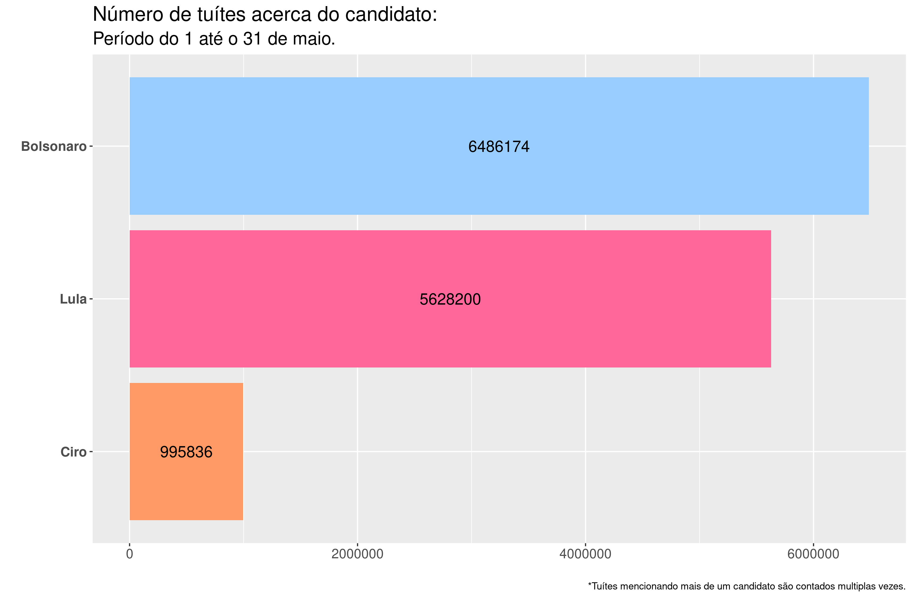
```
</center>


Em relação ao mês de abril, se manteve a frequência anterior. É possível destacar, contudo, que diminui a distância que separava Bolsonaro e Lula. Em abril, essa distância era de quase 2 milhões de tuítes. Em maio, tal diferença cai para menos de um milhão.  Comparado com o mês anterior, o número de tuítes mencionando os candidatos aumentou em aproximadamente 5% (Bolsonaro), 33% (Lula) e 39% (Ciro). É importante mencionar que a diferença do número de tuítes mencionando Bolsonaro e Lula é menor no mês de maio (menos de um milhão) do que no mês de abril (aproximadamente dois milhões).


Na evolução diária do número de tuítes (Figura 5), pode-se observar que, em geral, Ciro apresenta a menor quantidade do número de tuítes (exceto no dia 21 de maio onde este número superou levemente o número de tuítes do Lula). Por outro lado, o número de tuítes mencionando Bolsonaro é, geralmente, maior do que os outros candidatos ao longo do mês, com exceção de 7 dias na primeira quinzena do mês, em que Lula apresentou uma quantidade diária de tuítes maior. 

 


<center>
```{r echo = FALSE, out.width = "85%", fig.cap = "Evolução diária da quantitate de tuítes sobre os candidatos"}
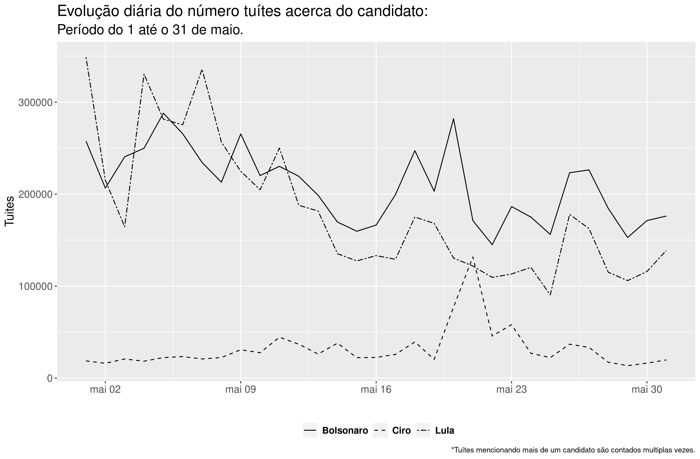
```
</center>


### Nuvem de palavras


<aside>
Uma nuvem de palavras é uma representação gráfica das palavras mais frequentes dentro de um texto ou conjunto de textos. 
</aside>


A seguir, apresentamos três nuvens de palavras, onde cada uma corresponde a um candidato. É importante sinalizar que o nome de cada candidato foi retirado da sua própria nuvem, para melhor visualização das palavras associadas. Cabe ressaltar também, que cada nuvem reflete as 100 palavras mais relevantes associadas, excluídas stop words, a cada candidato nas interações dos usuários do Twitter nos 31 dias do mês de maio.


_Clique no nome do candidato para ver a respectiva nuvem de palavras._

<aside>
Em análise de texto, _stop words_ são palavras bastante comuns tais como "e", "de", "o", etc. Essas palavras não são úteis para as análises e costumam ser removidas antes das análises.
</aside>


```{r panelset, layout='l-page', echo=FALSE}
xaringanExtra::use_panelset()
xaringanExtra::style_panelset_tabs(foreground = "honeydew", background = "#0F2E3D")
```

::::: {.panelset}

::: {.panel}

#### Bolsonaro {.panel-name}

<center>
```{r echo = FALSE, out.width = "70%", fig.cap = "Nuvem de Palavras do Bolsonaro"}
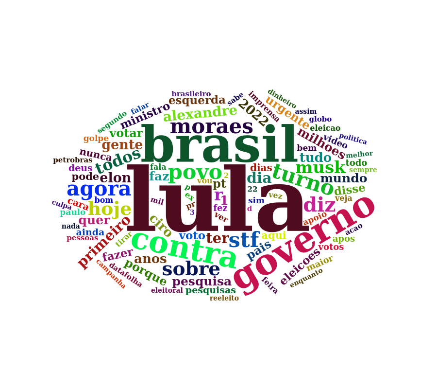
```
</center>

:::

::: {.panel}

#### Lula {.panel-name}

<center>
```{r echo = FALSE, out.width = "90%", fig.cap = "Nuvem de Palavras do Lula"}
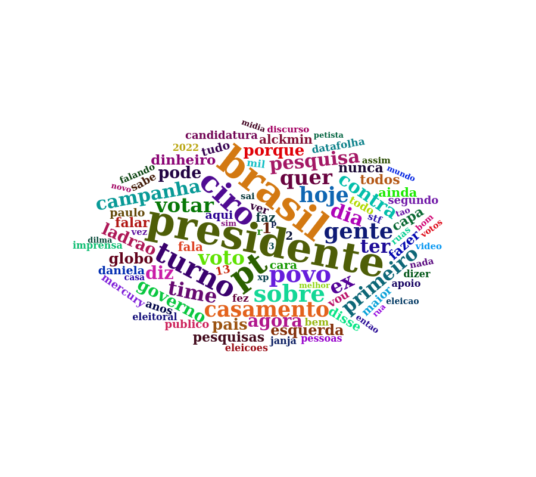
```
</center>

:::

::: {.panel}

#### Ciro {.panel-name}

<center>
```{r echo = FALSE, out.width = "80%", fig.cap = "Nuvem de Palavras do Ciro"}
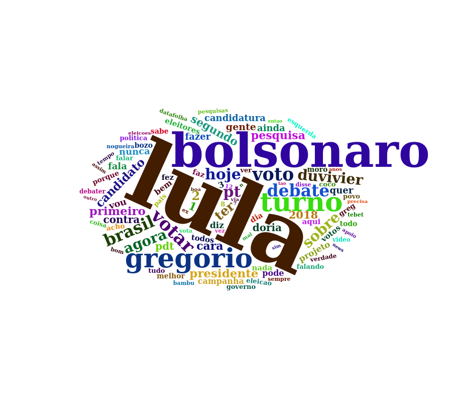
```
</center>

:::

:::::


Ao analisar as nuvens, compartilhamos a primeira impressão de cada uma:


- **Bolsonaro:** em primeiro plano se consolidam as palavras “Lula”, “Brasil” e “governo’’. Em segundo plano, “agora”, “contra”, “Moraes”, “hoje”, “povo”, “turno” e “STF”.
- **Lula:** em primeiro plano aparecem “presidente”, “Brasil”, “PT”, “Ciro” e “turno”; em segundo plano “casamento”, “campanha”, “primeiro”, turno”, “Time”, “pesquisa”, “votar”, “voto”, “porque”, “quer”, “hoje”, “dia”, “gente”, “ter” e “agora”. Vale observar que a menção à palavra “Time” não se limitou à semana em que o ex-presidente Lula é capa da revista Time, mas se manteve no perfil mensal observado.
- **Ciro:** a tendência se manteve em primeiro plano, de modo isolado, destacam-se as referências a “Lula”, “Bolsonaro”, “Gregorio” e “turno”; em segundo plano, “turno”, “Brasil”, “votar”, “agora”, “hoje”, “Duvivier”, e “debate”.


### Análise de sentimentos


O sentimento de cada tuíte foi construído através da identificação dos sentimentos das unidades básicas (as palavras) utilizando os dicionários oplexicon v3.0 e sentilex, do pacote lexiconPT. Assim, cada palavra encontrada nos dicionários recebe a nota 1, -1 ou 0, a depender de se o sentimento for positivo, negativo ou neutro, respectivamente. Palavras não encontradas nos dicionários recebem também nota 0. Os valores atribuídos a cada palavra dentro do tuíte foram somados, e a depender do resultado positivo, negativo ou zero, o sentimento do tuíte é classificado como positivo, negativo ou neutro. Na Figura 9 são apresentados os sentimentos (Negativo, Neutro e Positivo) percentualmente por candidato. É possível destacar um equilíbrio entre os sentimentos expressos nos tuítes dos três candidatos. Tais dados serão acompanhados ao longo do tempo comparativamente. Esse é um retrato, um instantâneo sentimental no mês de maio.


<center>
```{r echo = FALSE, out.width = "85%", fig.cap = "Sentimentos dos tuítes por candidato"}
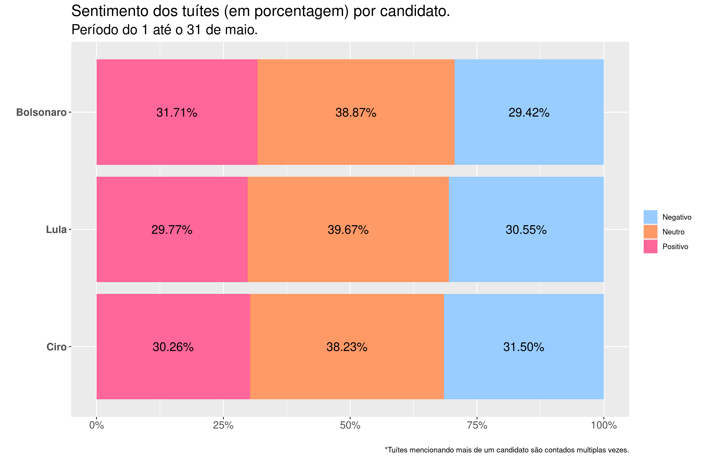
```
</center>


A seguir, é possível observar a nuvem de palavras de cada um dos candidatos, apresentadas em separado, segundo os sentimentos atribuídos a cada tuíte. Palavras em verde aparecem nos tuítes classificados como associados a sentimentos positivos, palavras em vermelho aparecem nos tuítes classificados como associados a sentimentos negativos, e palavras em amarelo aparecem nos tuítes classificados como neutros.


<aside>
As nuvens de palavras com sentimentos consideram as 200 palavras mais frequentes.
</aside>


::::: {.panelset}

::: {.panel}

#### Bolsonaro {.panel-name}

<center>
```{r echo = FALSE, out.width = "100%", fig.cap = "Nuvem de Palavras do Bolsonaro com sentimentos."}
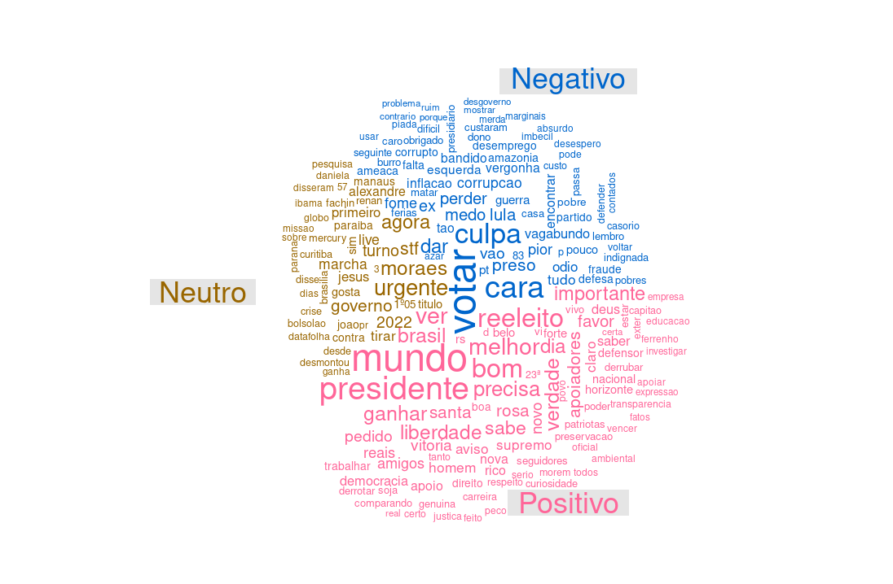
```
</center>

:::

::: {.panel}

#### Lula {.panel-name}

<center>
```{r echo = FALSE, out.width = "100%", , fig.cap = "Nuvem de Palavras do Lula com sentimentos."}
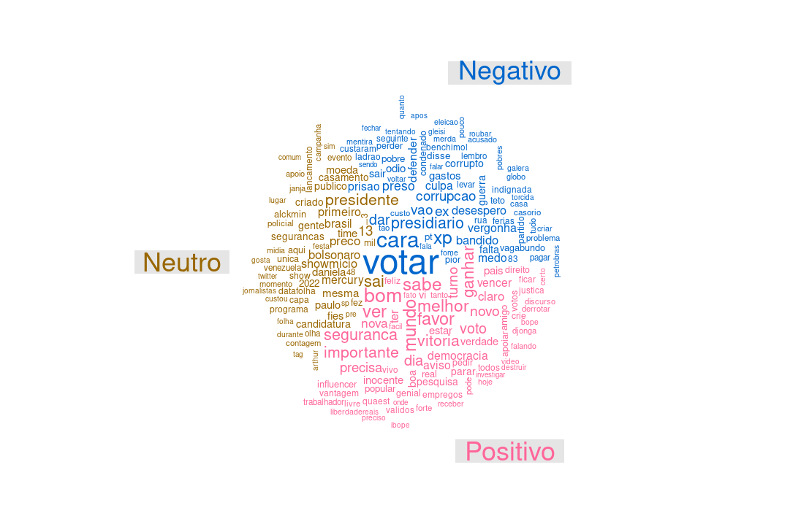
```
</center>

:::

::: {.panel}

#### Ciro {.panel-name}

<center>
```{r echo = FALSE, out.width = "100%", fig.cap = "Nuvem de Palavras do Ciro com sentimentos."}
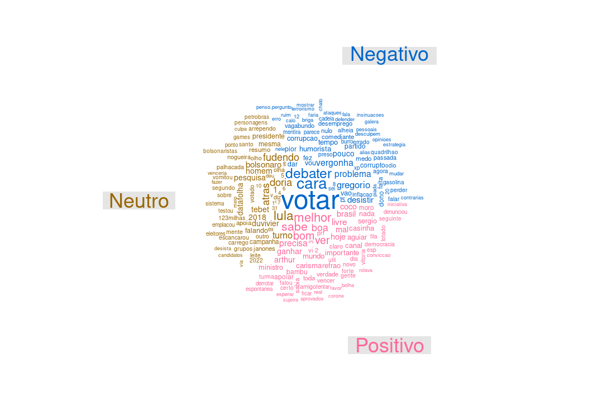
```
</center>

:::

:::::


- **Bolsonaro:** Os tuítes relacionados ao candidato Bolsonaro que foram classificados como associados a sentimentos positivos estão caracterizados por palavras como “mundo”, “presidente”, “bom”, “melhor” e “reeleito”. Já os tuites classificados como associados a sentimentos negativos são caracterizados por palavras como “votar”, “culpa”, “cara” e “preso”. Por último, tuítes considerados como neutros são caracterizados por palavras como “Moraes”, “agora”, “urgente”, “governo” e “2022”.
- **Lula:** Os tuítes relacionados ao candidato Lula que foram classificados como associados a sentimentos positivos estão caracterizados por palavras como “bom”, “sabe”, “mundo”, “ver”, “melhor” e “favor”. Já os tuítes classificados como negativos estão caracterizados por palavras como “votar”, “cara”, “XP” e “presidiário”. Por último, os tuítes com sentimento neutro estão caracterizados por palavras como “sai”, “presidente”, “primeiro”, “13”, “preso”, “Bolsonaro” e “showmício”.
- **Ciro:** Os tuítes relacionados ao candidato Ciro que foram classificados como associados a sentimentos positivos estão caracterizados por palavras como “melhor”, “sabe”, “bom”, “boa” e “ver”.  Já os tuítes classificados como negativos estão caracterizados por palavras como “votar”, “cara” e “debater”. Por último, os tuítes com sentimento neutro estão caracterizados por palavras como “fudendo”, “Bolsonaro”, “Doria”, “atrás” e “Lula”.


## Bigramas

<aside>
Bigramas são pares de palavras que aparecem conjuntamente ao longo dos tuítes.
</aside>

Os 25 bigramas mais frequentes nos tuítes mencionando cada um dos candidatos são apresentados nas Figuras 13 – 15. A direção da seta revela a ordem em que o bigrama aparece e quanto maior a intensidade da seta, maior a frequência do bigrama.


::::: {.panelset}

::: {.panel}

#### Bolsonaro {.panel-name}

<center>
```{r echo = FALSE, out.width = "100%", fig.cap = "Bigramas do Bolsonaro."}
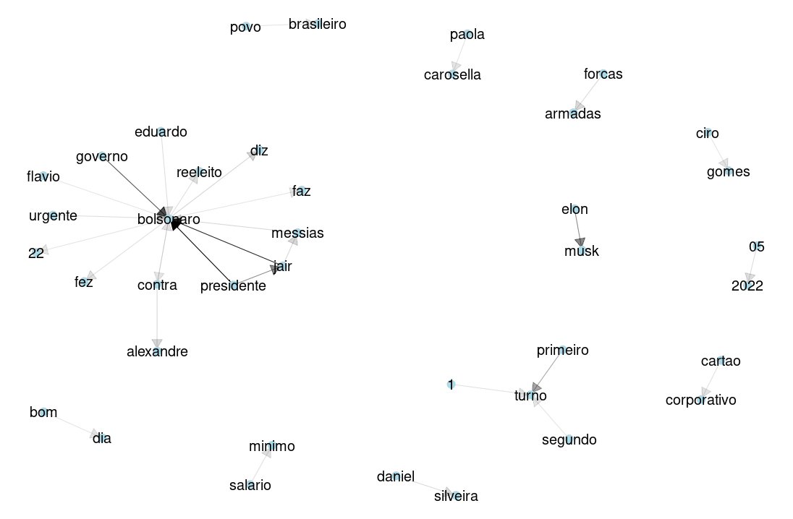
```
</center>

:::

::: {.panel}

#### Lula {.panel-name}

<center>
```{r echo = FALSE, out.width = "100%", fig.cap = "Bigramas do Lula."}
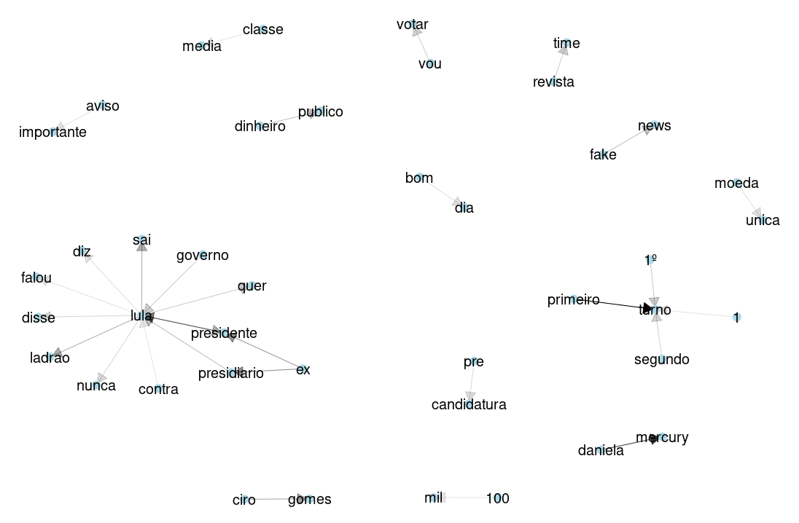
```
</center>

:::

::: {.panel}

#### Ciro {.panel-name}

<center>
```{r echo = FALSE, out.width = "100%", fig.cap = "Bigramas do Ciro."}
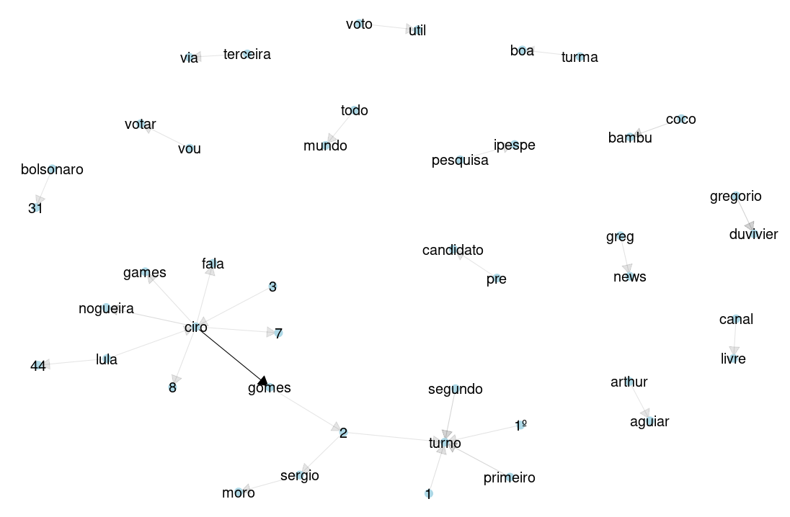
```
</center>

:::

:::::


- **Bolsonaro:** entre os bigramas mais frequentes temos “presidente $\rightarrow$ Bolsonaro", “Jair $\rightarrow$ Bolsonaro” e “governo $\rightarrow$ Bolsonaro”. Outros bigramas diretamente relacionados a estes e que chamam nossa atenção são a sequência “Bolsonaro $\rightarrow$ contra $\rightarrow$ Alexandre” referindo-se à discrepância entre o atual presidente e o atual ministro do STF. Em sentido similar, as sequências “Flavio $\rightarrow$ Bolsonaro” e “Eduardo $\rightarrow$ Bolsonaro” são também frequentes, trazendo a referência a tuítes que podem não necessariamente se referir ao candidato presidencial, mas aos seus filhos. Também é possível destacar as menções laterais “Forças $\rightarrow$ Armadas”, “Elon $\rightarrow$  Musk” e “primeiro $\rightarrow$ turno”.
- **Lula:** entre os bigramas mais frequentes temos “ex $\rightarrow$ presidente/presidiário $\rightarrow$ Lula”, que se desdobra, a partir do nome “Lula $\rightarrow$ quer”, “governo $\rightarrow$ Lula”, “ Lula $\rightarrow$ sai”, “Lula $\rightarrow$ diz”, “Lula $\rightarrow$ falou”, “Lula $\rightarrow$ disse”, “Lula $\rightarrow$ ladrão”, “Lula $\rightarrow$ nunca”, “Lula $\rightarrow$ contra“. Secundariamente, “primeiro $\rightarrow$ turno, “segundo $\rightarrow$ turno”, “Daniela $\rightarrow$ Mercury”, “classe $\rightarrow$ média”, “vou $\rightarrow$ votar”, “revista $\rightarrow$ time”, “fake $\rightarrow$ news”, “dinheiro $\rightarrow$ público”, dentre outros.  
- **Ciro:** entre os bigramas mais frequentes temos, predominantemente, “Ciro $\rightarrow$ Gomes”, “Ciro $\rightarrow$ games”, “Ciro $\rightarrow$ fala”, “Ciro $\rightarrow$ Lula”, “Sérgio $\rightarrow$ Moro”, seguido por “Bolsonaro $\rightarrow$ 31”, “terceira $\rightarrow$ via”, “segundo $\rightarrow$  turno”, “todo $\rightarrow$ mundo”, “ipespe $\rightarrow$ pesquisa”, “Gregorio $\rightarrow$ Duvivier”, “voto $\rightarrow$ útil”, dentre outros.  


## Comentários finais

A apresentação desse conjunto de dados visa contribuir para interpretações sobre a movimentação no Twitter dos possíveis candidatos nas eleições de 2022, bem como sobre o que se fala a seu respeito nas interações dos usuários da plataforma no mês de maio. Esse é um trabalho de pesquisa em andamento e será aperfeiçoado no transcorrer dos meses até a eleição de 2022.


