## Como os dados foram extraídos

Para cada candidato, foram coletados tuítes referentes a cada um dos 30 dias do mês de junho, totalizando mais de 12,7 milhões de tuítes. Os dados foram extraídos através de uma API do twitter utilizada exclusivamente para fins acadêmicos e analisados utilizando o software R.


<aside>
Os autores agradecem ao Twitter pelas contas acadêmicas a eles concedidas.
</aside>

## Número de seguidores

A seguir, apresentamos o número atualizado (junho em relação a maio, dados de 19 de julho de 2022) de seguidores no Twitter de cada um dos candidatos.

- **Bolsonaro** - de 8,2 milhões para 8,4 milhões (acréscimo de 2,4% de seguidores em relação ao mês anterior)
- **Lula** - de 3,6 milhões para 3,8 milhões (acréscimo de 5,6% de seguidores em relação ao mês anterior)
- **Ciro** - 1,3 milhões para 1,4 milhões (acréscimo de 7,7% em relação ao mês anterior)


## Tuítes dos candidatos

Na Figura 1 abaixo, apresentamos um gráfico com o número de tuítes da timeline dos candidatos, dentre os três que fazem parte de nosso levantamento: Lula, Ciro e Bolsonaro, de acordo com a frequência com que os candidatos tuitaram no mês de junho.


<center>
```{r echo = FALSE, out.width = "85%", fig.cap = "Número de tuítes na timeline dos candidatos"}
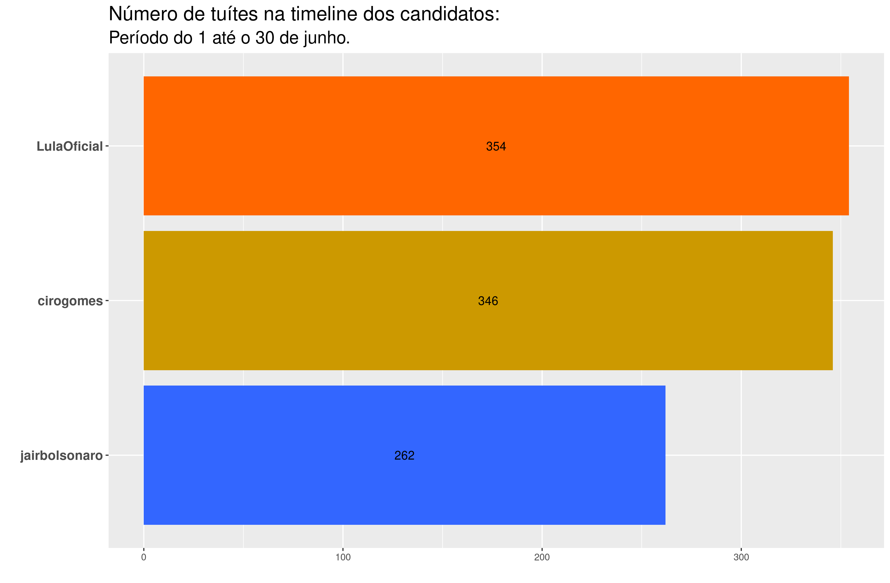
```
</center>


As Figuras 2 e 3 apresentam as palavras mais frequentes nos tuítes da timeline dos candidatos, e as palavras mais frequentes nos tuítes da timeline dos candidatos que não foram tão frequentes nos tuítes da timeline dos outros candidatos, respectivamente.


<center>
```{r echo = FALSE, out.width = "100%", fig.cap = "Palavras mais frequentes na timeline dos candidatos"}
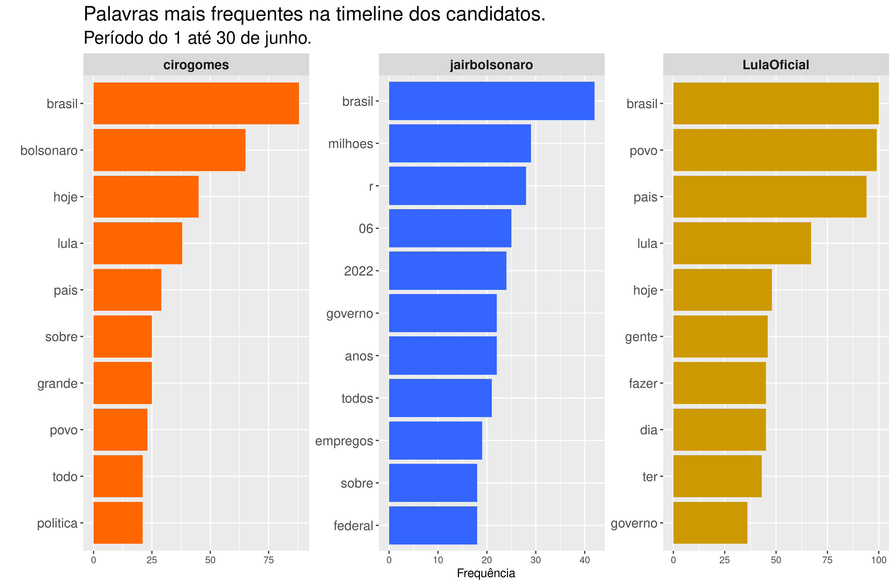
```
</center>

A análise das palavras mais frequentes nos tuítes da timeline dos candidatos (Figura 2) nos permite apresentar um panorama dominante dos assuntos por eles tratados. Em comum nos três perfis encontramos o termo “Brasil”, mantendo o padrão encontrado em maio. Nos perfis de Lula e Ciro, em comum os termos “povo” e “país”. Já entre Lula e Bolsonaro, o termo comum encontrado foi “governo”. No perfil de Lula isoladamente há destaque para os verbos “ter” e “fazer” denotando uma continuidade do caráter propositivo já encontrado anteriormente, bem como a menção a palavras como “gente”, “hoje” e “dia”. No perfil de Ciro, se mantém a preocupação em mencionar nominalmente os outros dois candidatos, como observado em abril e maio. É possível destacar no consolidado do mês de junho, as menções a “política”, “sobre”, “grande” e “todo”. Por fim, no perfil de Bolsonaro é possível apontar uma continuidade, em relação aos meses de abril e maio, com destaque em junho aos feitos do governo, em especial, aos gastos em “reais (r)” expressos em cifras de “milhões”. A novidade consolidada em relação ao mês de maio surge na menção ao termo “empregos” associado a essas cifras, bem como “federal”, “anos” e “2022”.


<center>
```{r echo = FALSE, out.width = "100%", fig.cap = "TF-IDF da timeline dos candidados"}
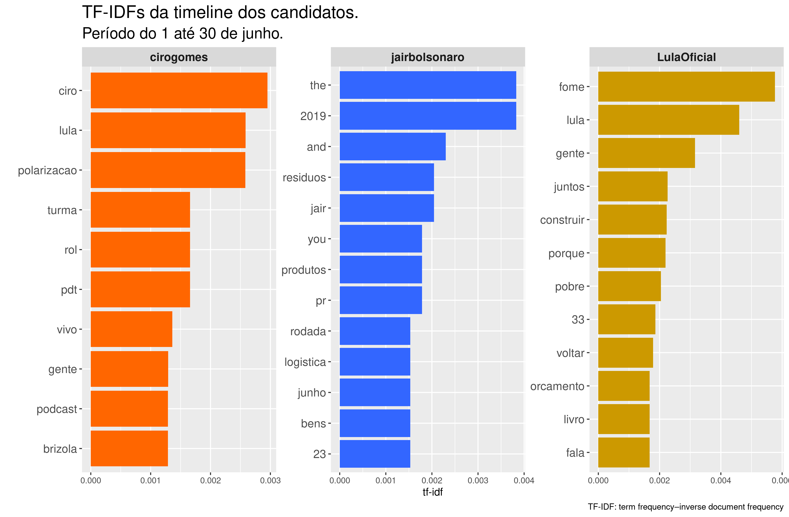
```
</center>

Na Figura 3, TF-IDF (term frequency-inverse document frequency) reflete a frequência das palavras nos tuites da timeline dos candidatos, que não são tão frequentes para os três candidatos em geral. Assim:

- No perfil de Lula, há novidade nas ações propositivas consolidadas em junho, com ênfase dada ao uso dos verbos “construir” e “voltar”. Se observam menos verbos e, por outro lado, mais substantivos novos como “fala”, “povo”, “pobre”, “livro”, “porque”, “fome”, “gente”, “juntos” e “orçamento”. Interessante destacar que o destaque de junho foi a palavra “fome”.
- O perfil de Bolsonaro apresenta em destaque as palavras em inglês “the”, “you” e “and”, estas devem-se à participação do presidente na Cúpula das Américas, mas não trazem nenhum significado importante para nossas análises. A referência ao ano de “2019” se mantém desde o mês de abril, mostrando uma tentativa de ênfase aos feitos do governo no ano anterior à pandemia. As novidades de junho aparecem nas menções às palavras “resíduos”, “Jair”, “produtos”, “pr”, “rodada”, “logística”, “junho” e “bens”.
- No perfil de Ciro a novidade em junho aparece na ênfase dada aos termos “Ciro”, polarização” e “Lula”. Há também a menção às palavras “turma”, “vivo”, “gente” e “podcast”, bem como aos termos “rol”, “PDT” e “Brizola”. 


## Tuítes sobre os candidatos


Na sequência, na Figura 4, apresentamos em ordem decrescente (do mais citado ao menos citado), o total de tuítes que mencionaram o nome de cada candidato pesquisado no mês de junho: Bolsonaro, Lula e Ciro. 


<aside>
Para coletar os tuites mencionando os respectivos candidatos, foram utilizados como critério de busca as palavras "Bolsonaro", "Ciro" e "Lula". Tuítes mencionando "Ciro Nogueira" foram excluidos das análises referentes ao candidato Ciro.
</aside>

<center>
```{r echo = FALSE, out.width = "85%", fig.cap = "Total de tuítes sobre os candidatos"}
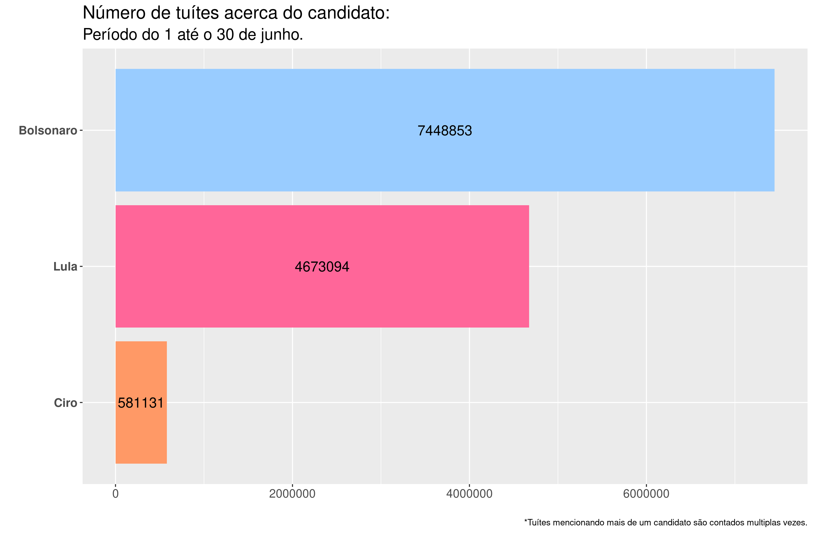
```
</center>


Em relação ao mês de maio, as interações em torno do nome de Bolsonaro em junho se intensificaram, ao passo que as interações mencionando Lula e Ciro diminuíram. É possível destacar que aumenta a distância que separava Bolsonaro de Lula. Em abril, essa distância era de quase 2 milhões de tuítes. Em junho, tal diferença passa dois dois milhões. O número de tuítes mencionando Lula representa aproximadamente 63% do total de tuítes mencionando Bolsonaro, voltando a um patamar parecido com o encontrado em abril (68.12%), mas substancialmente diferente do mês de maio (86.7%). O número de tuítes mencionando Ciro é o menor nos três últimos meses. Comparado com o mês anterior, o número de tuítes mencionando Ciro caiu em mais de 40%


Na evolução diária de tuítes (Figura 5) pode-se verificar que Ciro apresenta o menor número de iterações diárias. Embora Bolsonaro apresente uma maior interação diária no número de tuítes durante o mês, em quatro momentos os tuítes mencionando Lula foram maiores do que os do Bolsonaro.

 


<center>
```{r echo = FALSE, out.width = "85%", fig.cap = "Evolução diária da quantitate de tuítes sobre os candidatos"}
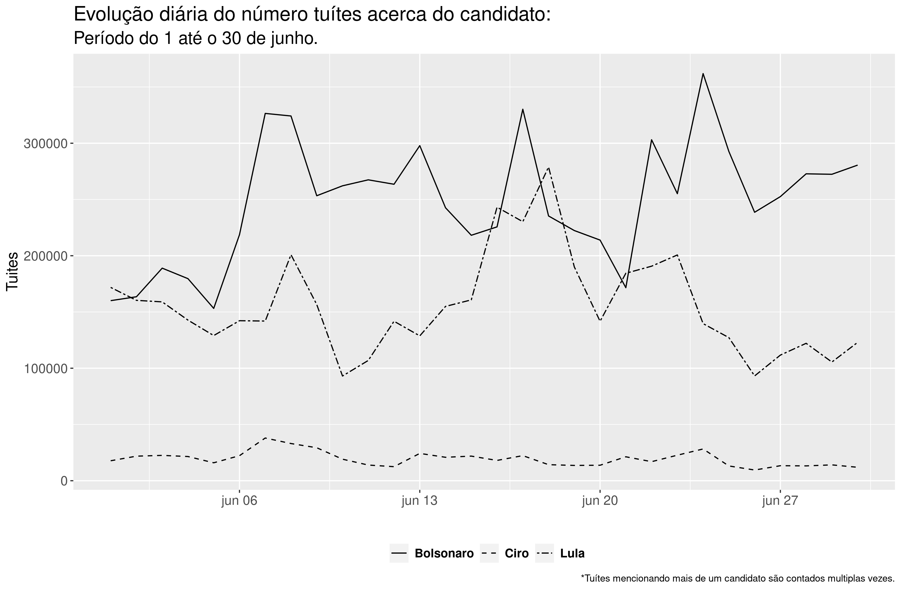
```
</center>


### Nuvem de palavras


<aside>
Uma nuvem de palavras é uma representação gráfica das palavras mais frequentes dentro de um texto ou conjunto de textos. 
</aside>


A seguir, apresentamos três nuvens de palavras, onde cada uma corresponde a um candidato. É importante sinalizar que o nome de cada candidato foi retirado da sua própria nuvem, para melhor visualização das palavras associadas. Cabe ressaltar também, que cada nuvem reflete as 100 palavras mais relevantes associadas, excluídas stop words, a cada candidato nas interações dos usuários do Twitter no mês de junho. 


_Clique no nome do candidato para ver a respectiva nuvem de palavras._

<aside>
Em análise de texto, _stop words_ são palavras bastante comuns tais como "e", "de", "o", etc. Essas palavras não são úteis para as análises e costumam ser removidas antes das análises.
</aside>


```{r panelset, layout='l-page', echo=FALSE}
xaringanExtra::use_panelset()
xaringanExtra::style_panelset_tabs(foreground = "honeydew", background = "#0F2E3D")
```

::::: {.panelset}

::: {.panel}

#### Bolsonaro {.panel-name}

<center>
```{r echo = FALSE, out.width = "70%", fig.cap = "Nuvem de Palavras do Bolsonaro"}
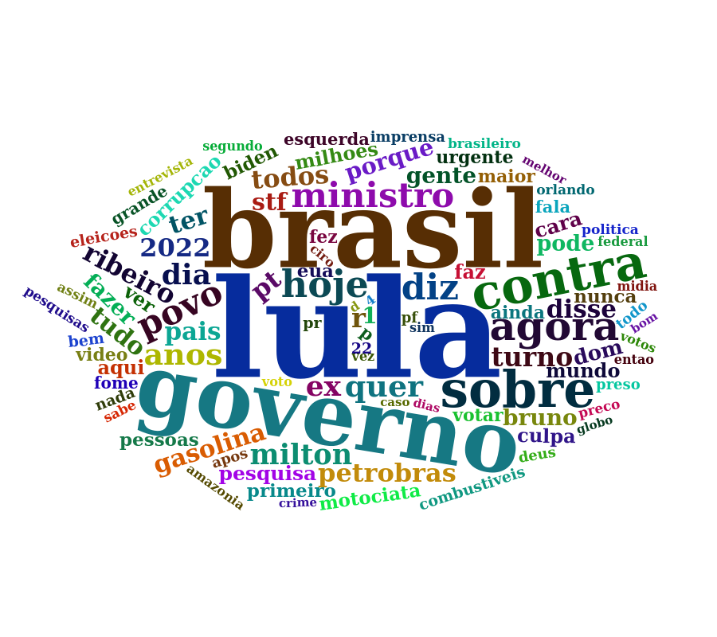
```
</center>

:::

::: {.panel}

#### Lula {.panel-name}

<center>
```{r echo = FALSE, out.width = "90%", fig.cap = "Nuvem de Palavras do Lula"}
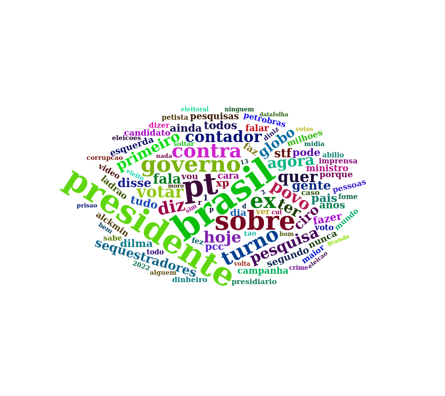
```
</center>

:::

::: {.panel}

#### Ciro {.panel-name}

<center>
```{r echo = FALSE, out.width = "80%", fig.cap = "Nuvem de Palavras do Ciro"}
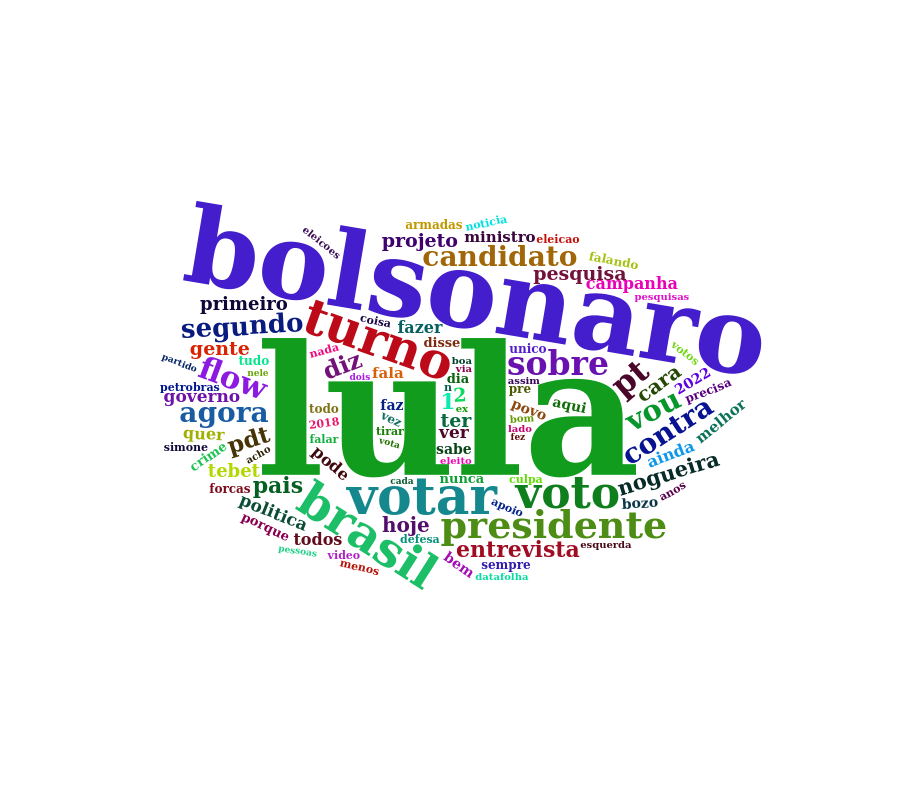
```
</center>

:::

:::::


Ao analisar as nuvens, compartilhamos a primeira impressão de cada uma:

- **Bolsonaro:** em primeiro plano se consolidam as palavras “Lula”, “Brasil” e “governo’’. Em segundo plano, “agora”, “contra”, “sobre”.
- **Lula:** em primeiro plano aparecem “Brasil”, “PT” e “presidente”; em segundo plano “contra”, “governo”, “sobre”.
- **Ciro:** a tendência se manteve em primeiro plano, de modo isolado, destacam-se as referências a “Lula” e “Bolsonaro”; em segundo plano, “turno”, “votar” e “voto”.


### Análise de sentimentos


O sentimento de cada tuíte foi construído através da identificação dos sentimentos das unidades básicas (as palavras) utilizando os dicionários `oplexicon v3.0` e `sentilex`, do pacote `lexiconPT`. Assim, cada palavra encontrada nos dicionários recebe a nota 1, -1 ou 0, a depender de se o sentimento for positivo, negativo ou neutro, respectivamente. Palavras não encontradas nos dicionários recebem também nota 0. Os valores atribuídos a cada palavra dentro do tuíte foram somados, e a depender do resultado positivo, negativo ou zero, o sentimento do tuíte é classificado como positivo, negativo ou neutro. Na Figura 9 são apresentados os sentimentos (Negativo, Neutro e Positivo) percentualmente por candidato. É possível destacar um equilíbrio entre os sentimentos expressos nos tuítes dos três candidatos. Tais dados serão acompanhados ao longo do tempo comparativamente. Esse é um retrato, um instantâneo sentimental no mês de junho.


<center>
```{r echo = FALSE, out.width = "85%", fig.cap = "Sentimentos dos tuítes por candidato"}
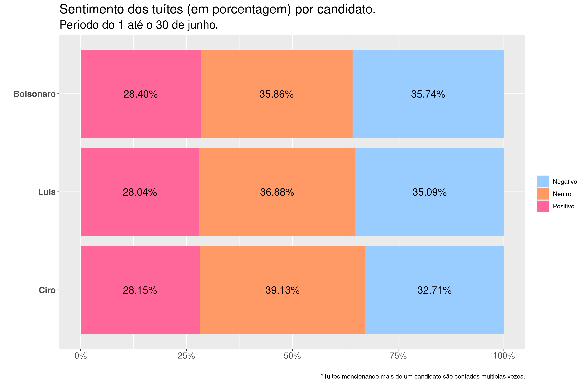
```
</center>


A seguir, é possível observar a nuvem de palavras de cada um dos candidatos, apresentadas em separado, segundo os sentimentos atribuídos a cada tuíte. Palavras em rosa aparecem nos tuítes classificados como associados a sentimentos positivos, palavras em azul aparecem nos tuítes classificados como associados a sentimentos negativos, e palavras em laranja aparecem nos tuítes classificados como neutros.


<aside>
As nuvens de palavras com sentimentos consideram as 200 palavras mais frequentes.
</aside>


::::: {.panelset}

::: {.panel}

#### Bolsonaro {.panel-name}

<center>
```{r echo = FALSE, out.width = "100%", fig.cap = "Nuvem de Palavras do Bolsonaro com sentimentos."}
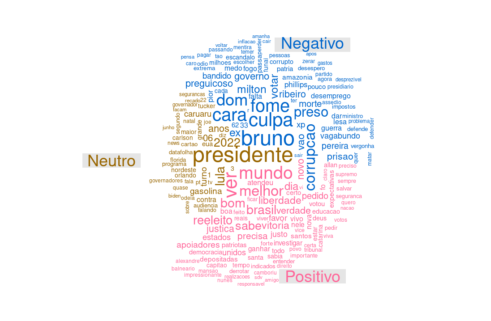
```
</center>

:::

::: {.panel}

#### Lula {.panel-name}

<center>
```{r echo = FALSE, out.width = "100%", , fig.cap = "Nuvem de Palavras do Lula com sentimentos."}
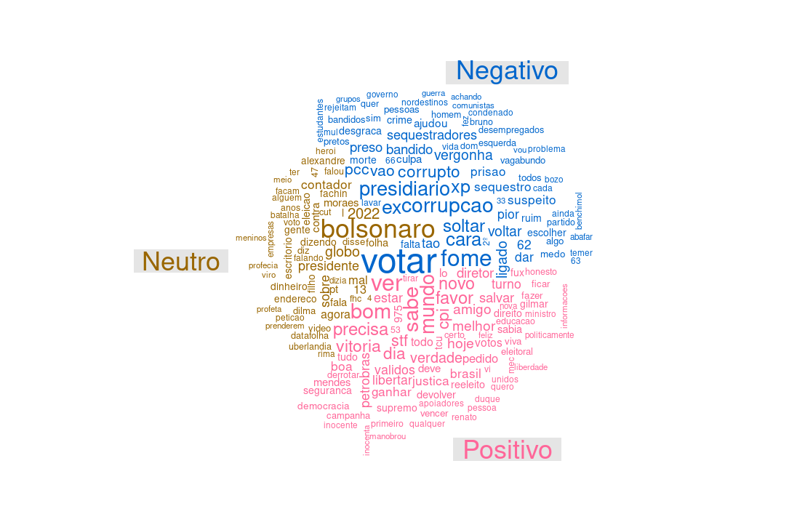
```
</center>

:::

::: {.panel}

#### Ciro {.panel-name}

<center>
```{r echo = FALSE, out.width = "100%", fig.cap = "Nuvem de Palavras do Ciro com sentimentos."}
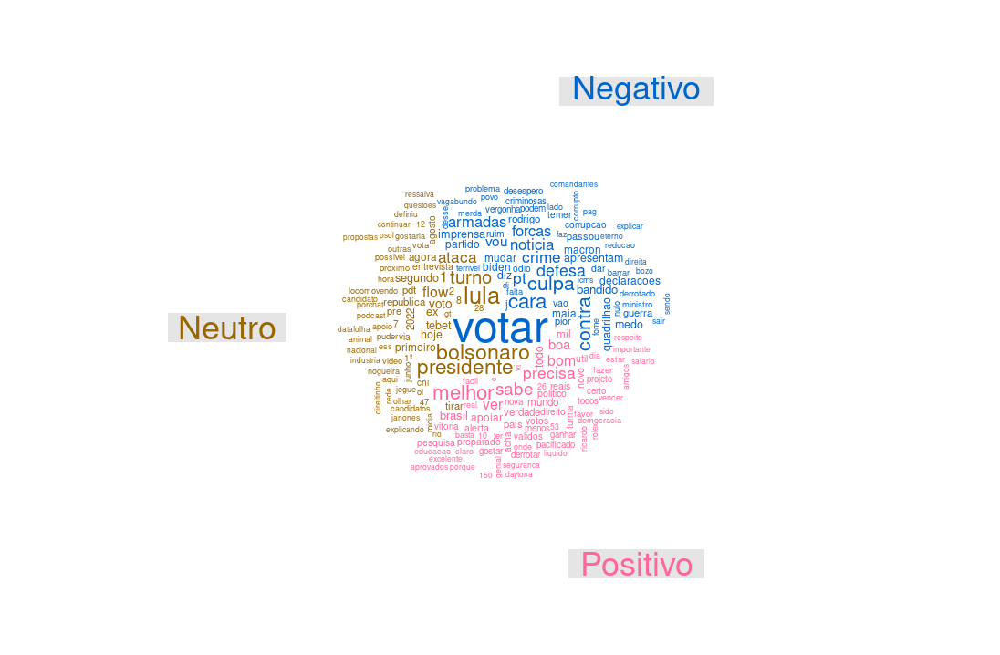
```
</center>

:::

:::::


- **Bolsonaro:** Os tuítes relacionados ao candidato Bolsonaro que foram classificados como associados a sentimentos positivos estão caracterizados por palavras como “mundo”, “ver” e “melhor”. Já os tuites classificados como associados a sentimentos negativos são caracterizados por palavras como “Bruno”, “culpa”, “cara”, “fome” e “Dom”. (Os nomes Bruno e Dom se referem a Bruno Pereira e Dom Philips, respectivamente, indigenista e jornalista, assassinados no Vale do Javari, na Amazônia, no último mês de junho). Por último, tuítes considerados como neutros trazem em destaque a palavra “presidente”.
- **Lula:** Os tuítes relacionados ao candidato Lula que foram classificados como associados a sentimentos positivos estão caracterizados por palavras como “ver”, “sabe”, “mundo” e “bom”. Já os tuítes classificados como negativos estão caracterizados por palavras como “votar”, “fome”, “corrupção” e “presidiário”. Por último, os tuítes com sentimento neutro estão caracterizados principalmente pelo nome “Bolsonaro”.
- **Ciro:** Os tuítes relacionados ao candidato Ciro que foram classificados como associados a sentimentos positivos estão caracterizados por palavras como “melhor”, “sabe” e “precisa”. Já os tuítes classificados como negativos estão caracterizados por palavras como “votar”, “cara” e “culpa”. Por último, os tuítes com sentimento neutro estão caracterizados por palavras como “Lula”, “Bolsonaro” e “presidente”


## Bigramas

<aside>
Bigramas são pares de palavras que aparecem conjuntamente ao longo dos tuítes.
</aside>

Os 25 bigramas mais frequentes nos tuítes mencionando cada um dos candidatos são apresentados nas Figuras 13 – 15. A direção da seta revela a ordem em que o bigrama aparece e quanto maior a intensidade da seta, maior a frequência do bigrama.


::::: {.panelset}

::: {.panel}

#### Bolsonaro {.panel-name}

<center>
```{r echo = FALSE, out.width = "100%", fig.cap = "Bigramas do Bolsonaro."}
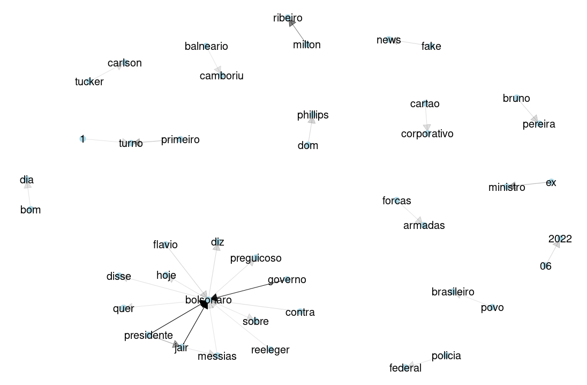
```
</center>

:::

::: {.panel}

#### Lula {.panel-name}

<center>
```{r echo = FALSE, out.width = "100%", fig.cap = "Bigramas do Lula."}
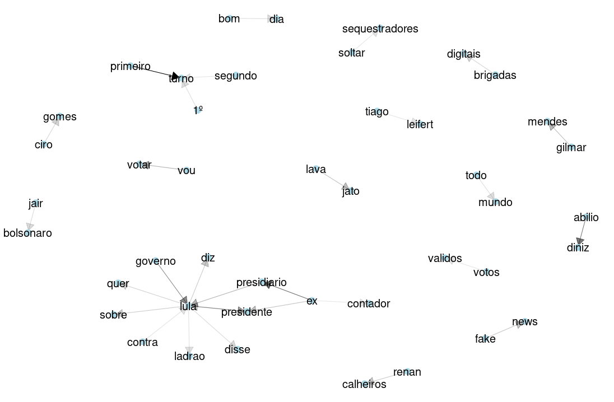
```
</center>

:::

::: {.panel}

#### Ciro {.panel-name}

<center>
```{r echo = FALSE, out.width = "100%", fig.cap = "Bigramas do Ciro."}
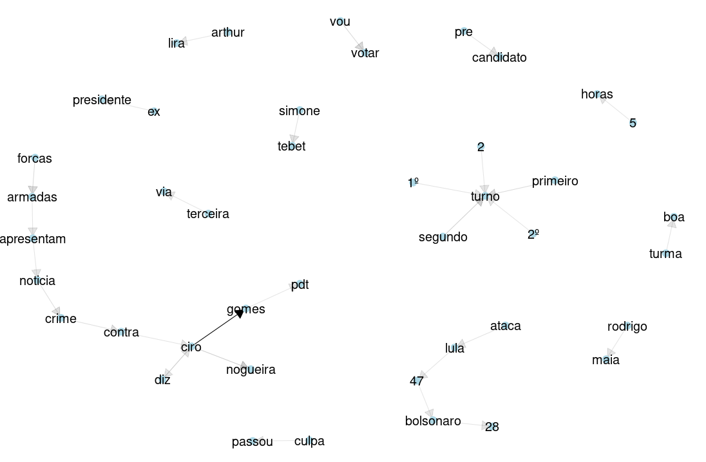
```
</center>

:::

:::::


- **Bolsonaro:** Bolsonaro: entre os bigramas mais frequentes temos “governo $\rightarrow$ Bolsonaro", “Jair $\rightarrow$ Bolsonaro” e “presidente $\rightarrow$ Bolsonaro”. Seguido a estes temos a sequência “Presidente $\rightarrow$ Jair”, “Milton $\rightarrow$ Ribeiro” , “fake $\rightarrow$ news”. Também é importante mencionar o bigrama “Dom $\rightarrow$ Philips” evidenciando a repercussão do assassinato do jornalista inglês na Amazônia.
- **Lula:**  entre os bigramas mais frequentes temos “primeiro $\rightarrow$ turno”, “ex $\rightarrow$ presidiário”, “Abílio $\rightarrow$ Diniz” e “governo $\rightarrow$ Lula”. Outros bigramas, porém com destaque menor, são “Lula $\rightarrow$ presidente”, “Gilmar $\rightarrow$  Mendes”, “Renan $\rightarrow$ Calheiros”, “brigadas $\rightarrow$ digitais”, “vou $\rightarrow$ votar” e “Lava $\rightarrow$ Jato”. 
- **Ciro:** entre os bigramas mais frequentes temos, predominantemente, “Ciro $\rightarrow$ Gomes”, seguido por “vou $\rightarrow$ votar”, “pré $\rightarrow$ candidato”, “ex $\rightarrow$ presidente”, dentre vários outros. 


## Comentários finais

A apresentação desse conjunto de dados visa contribuir para interpretações sobre a movimentação no Twitter dos possíveis candidatos nas eleições de 2022, bem como sobre o que se fala a seu respeito nas interações dos usuários da plataforma ao longo do mês de junho. Esse é um trabalho de pesquisa em andamento e será aperfeiçoado no transcorrer dos meses até a eleição de 2022.

Aqui pode lêr na integra as análises dos meses de [abril](https://twitterpolitico2022.github.io/posts/2022-05-02-abril-dos-presidenciveis-no-twitter/) e [maio](https://twitterpolitico2022.github.io/posts/2022-06-15-maio-dos-presidenciveis-no-twitter/).

> Pesquisadores(as) do [IPPUR/UFRJ](https://ippur.ufrj.br/) tem um boletim sobre política nas redes [aqui.](https://politicanasredes.com/)


