## Como os dados foram extraídos

Para cada candidato, foram coletados tuítes referentes a cada um dos 31 dias do mês de julho, totalizando mais de 14,7 milhões de tuítes. Os dados foram extraídos através de uma API do twitter utilizada exclusivamente para fins acadêmicos e analisados utilizando o software R.


<aside>
Os autores agradecem ao Twitter pelas contas acadêmicas a eles concedidas.
</aside>

## Número de seguidores

A seguir, apresentamos o número atualizado (julho em relação a maio, dados de 19 de agosto de 2022) de seguidores no Twitter de cada um dos candidatos.

- **Bolsonaro** - de 8,4 milhões para 8,6 (acréscimo de aproximadamente 2.5 % de seguidores em relação ao mês anterior)
- **Lula** - de  3,8 milhões para 4 milhões (acréscimo de aproximadamente 5% de seguidores em relação ao mês anterior)
- **Ciro** -  1,4 milhões (não houve alteração em relação ao mês anterior)


## Tuítes dos candidatos

Na Figura 1 abaixo, apresentamos um gráfico com o número de tuítes da timeline dos candidatos, dentre os três que fazem parte de nosso levantamento: Lula, Ciro e Bolsonaro, de acordo com a frequência com que os candidatos tuitaram no mês de junho.


<center>
```{r echo = FALSE, out.width = "85%", fig.cap = "Número de tuítes na timeline dos candidatos"}
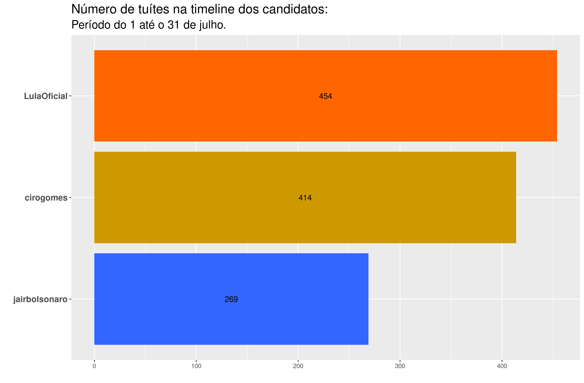
```
</center>


As Figuras 2 e 3 apresentam as palavras mais frequentes nos tuítes da timeline dos candidatos, e as palavras mais frequentes nos tuítes da timeline dos candidatos que não foram tão frequentes nos tuítes da timeline dos outros candidatos, respectivamente.


<center>
```{r echo = FALSE, out.width = "100%", fig.cap = "Palavras mais frequentes na timeline dos candidatos"}
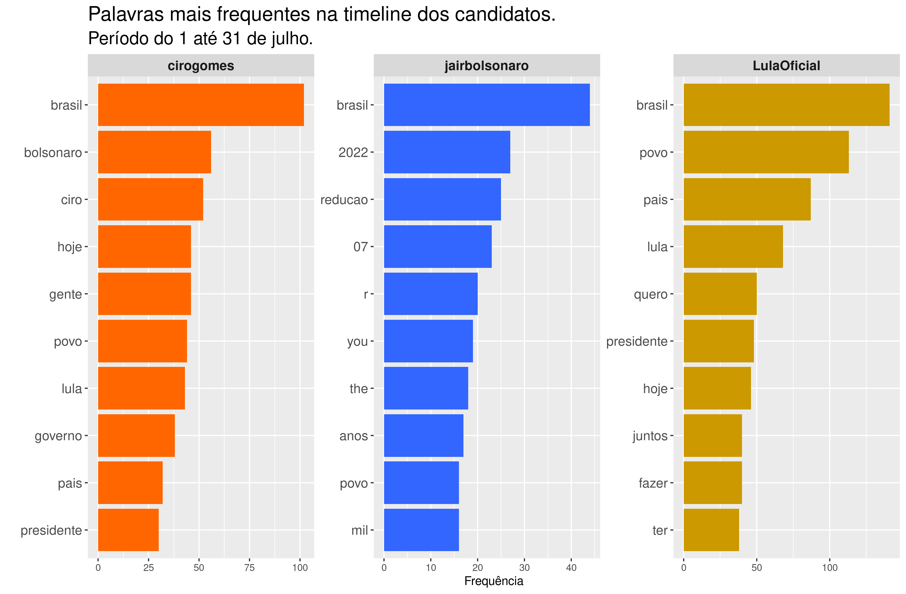
```
</center>

A análise das palavras mais frequentes nos tuítes da timeline dos candidatos (Figura 2) nos permite apresentar um panorama dominante dos assuntos por eles tratados. Em comum nos três perfis encontramos o termo “Brasil”, mantendo o padrão encontrado em maio e junho. A diferença surgiu na menção à palavra “povo”, também mencionada frequentemente nos três perfis. Embora o termo “povo” tenha destaque em todos os candidatos, ele é mais frequente no perfil de Lula do que nos demais candidatos. Nos perfis de Lula e Ciro, em comum os termos “Lula”, “país”, “hoje” e “presidente”.  No perfil de Lula isoladamente, o destaque para os verbos “ter” e “fazer” denota uma continuidade do caráter propositivo já encontrado em maio e junho, e a menção a palavras como “quero”, “hoje” e “juntos”, traz ênfase à construção de propostas. No perfil de Ciro, se mantém a preocupação em mencionar nominalmente os outros dois candidatos, como observado em abril, maio e junho. É possível destacar no consolidado do mês de junho, as menções aos termos “gente” e “governo”. Por fim, no perfil de Bolsonaro é possível identificar termos em inglês, devido a uma sequência de tuítes do dia 27 de julho em resposta ao Leonardo DiCaprio, a respeito da Amazônia (os quais tiveram bastante repercussão na rede). Outros destaques foram a menção a valores em reais (“r”) em termos de “mil”, “2022”, “07” e “redução”, sendo este último devido às discussões sobre a redução de impostos.

<aside>
Os termos em inglês no perfil do Bolsonaro são termos bastante frequentes na língua inglesa. Se stopwords na língua inglesa fossem também utilizados, os termos teriam desaparecido.
</aside>


<center>
```{r echo = FALSE, out.width = "100%", fig.cap = "TF-IDF da timeline dos candidados"}
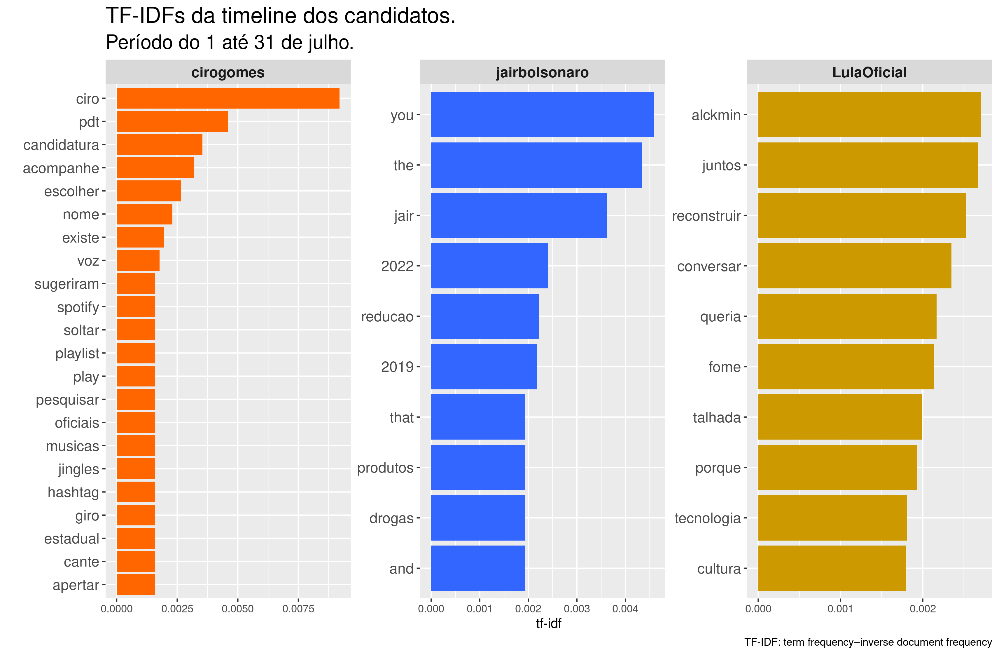
```
</center>

Na Figura 3, TF-IDF (term frequency-inverse document frequency) reflete a frequência das palavras nos tuites da timeline dos candidatos, que não são tão frequentes para os três candidatos em geral. Assim:


- No perfil de Lula, a novidade em julho está nos termos “Alckmin” (em referência ao vice de sua chapa), “juntos”, “reconstruir”, “conversar”, “tecnologia”, “cultura”, “queria” e “talhada” ( Serra Talhada e a região de Garanhuns em Pernambuco receberam uma  visita do candidato cujas imagens das multidões viralizaram no site). A ênfase que se manteve em relação a junho foi o tema da “fome”. 
- O perfil de Bolsonaro apresenta, novamente, destaque a palavras em inglês “the”, “you”, “that” e “and” (referentes aos tuítes em resposta ao ator Leonardo Dicaprio), bem como destaque aos anos 2019 (que se mantém desde o mês de abril, mostrando uma tentativa de ênfase aos feitos do governo no ano anterior à pandemia) e 2022.  Também há destaque para os termos “redução”, “produtos” e "drogas''. Termos em inglês também foram destaque no mês anterior, mas devido à participação do presidente na Cúpula das Américas.
- No perfil de Ciro a novidade em julho é uma pulverização de termos. “Ciro”, “pdt”, “candidatura”, “acompanhe”, “escolher”, “nome”, “existe“, “voz”, “sugeriram”, “spotify”, “soltar”, “playlist”, “play”, “pesquisar”, “oficiais”, "músicas", “jingles”, “hashtag”, “giro”, “estadual”, “cante” e “apertar”. Os termos “spotify”, “playlist”, “play”, “giro”, “Ciro” (“O Giro do Ciro” se refere a chamadas com takes e visitas da campanha), todos tem relação com a campanha midiática do candidato.


## Tuítes sobre os candidatos


Na sequência, na Figura 4, apresentamos em ordem decrescente (do mais citado ao menos citado), o total de tuítes que mencionaram o nome de cada candidato pesquisado no mês de junho: Bolsonaro, Lula e Ciro. 


<aside>
Para coletar os tuites mencionando os respectivos candidatos, foram utilizados como critério de busca as palavras "Bolsonaro", "Ciro" e "Lula". Tuítes mencionando "Ciro Nogueira" foram excluidos das análises referentes ao candidato Ciro.
</aside>

<center>
```{r echo = FALSE, out.width = "85%", fig.cap = "Total de tuítes sobre os candidatos"}
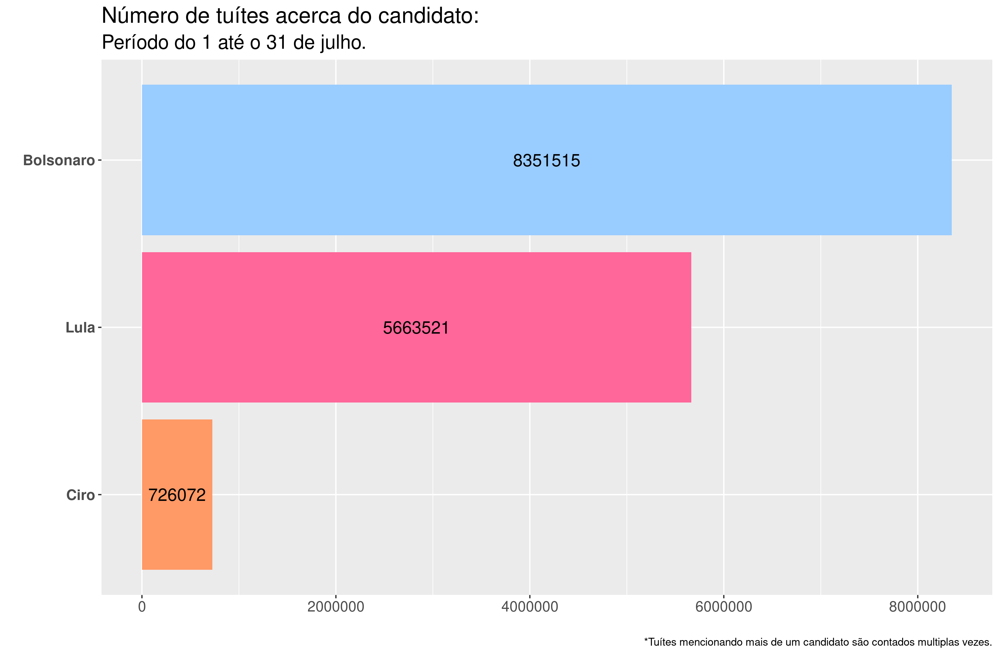
```
</center>


Em relação ao mês anterior, as interações de todos os candidatos se intensificaram, ou seja, todos estiveram mais assiduamente no Twitter. Na evolução diária de tuítes (Figura 5) pode-se verificar que Ciro apresenta o menor número de interações diárias e Bolsonaro o maior número de interações diárias (exceto nos dias 2 e 3 de julho, em que o número de tuítes de Lula foi levemente maior). A grande quantidade de tuítes mencionando Bolsonaro nos dias 18 e 19 de julho, referem-se à menção ao líder de uma facção criminosa no dia 18 e à redução do preço da gasolina no dia 19, quando o presidente afirma que “o Brasil terá uma das ‘gasolina’(sic) mais barata do mundo”.


<center>
```{r echo = FALSE, out.width = "85%", fig.cap = "Evolução diária da quantitate de tuítes sobre os candidatos"}
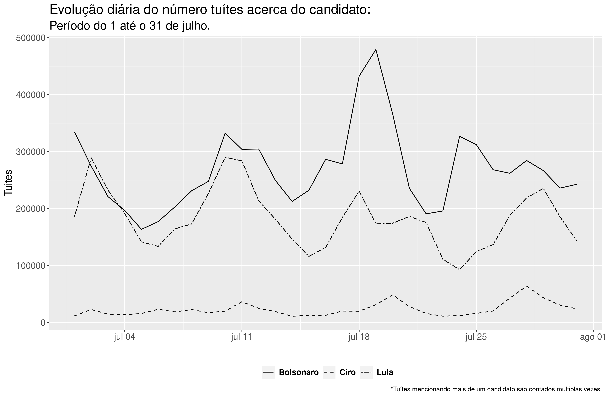
```
</center>


### Nuvem de palavras


<aside>
Uma nuvem de palavras é uma representação gráfica das palavras mais frequentes dentro de um texto ou conjunto de textos. 
</aside>


A seguir, apresentamos três nuvens de palavras, onde cada uma corresponde a um candidato. É importante sinalizar que o nome de cada candidato foi retirado da sua própria nuvem, para melhor visualização das palavras associadas. Cabe ressaltar também, que cada nuvem reflete as 100 palavras mais relevantes associadas, excluídas stop words, a cada candidato nas interações dos usuários do Twitter nos trinta e um dias do mês de julho.


_Clique no nome do candidato para ver a respectiva nuvem de palavras._

<aside>
Em análise de texto, _stop words_ são palavras bastante comuns tais como "e", "de", "o", etc. Essas palavras não são úteis para as análises e costumam ser removidas antes das análises.
</aside>


```{r panelset, layout='l-page', echo=FALSE}
xaringanExtra::use_panelset()
xaringanExtra::style_panelset_tabs(foreground = "honeydew", background = "#0F2E3D")
```

::::: {.panelset}

::: {.panel}

#### Bolsonaro {.panel-name}

<center>
```{r echo = FALSE, out.width = "70%", fig.cap = "Nuvem de Palavras do Bolsonaro"}
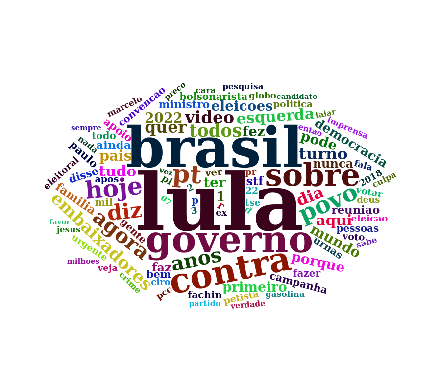
```
</center>

:::

::: {.panel}

#### Lula {.panel-name}

<center>
```{r echo = FALSE, out.width = "90%", fig.cap = "Nuvem de Palavras do Lula"}
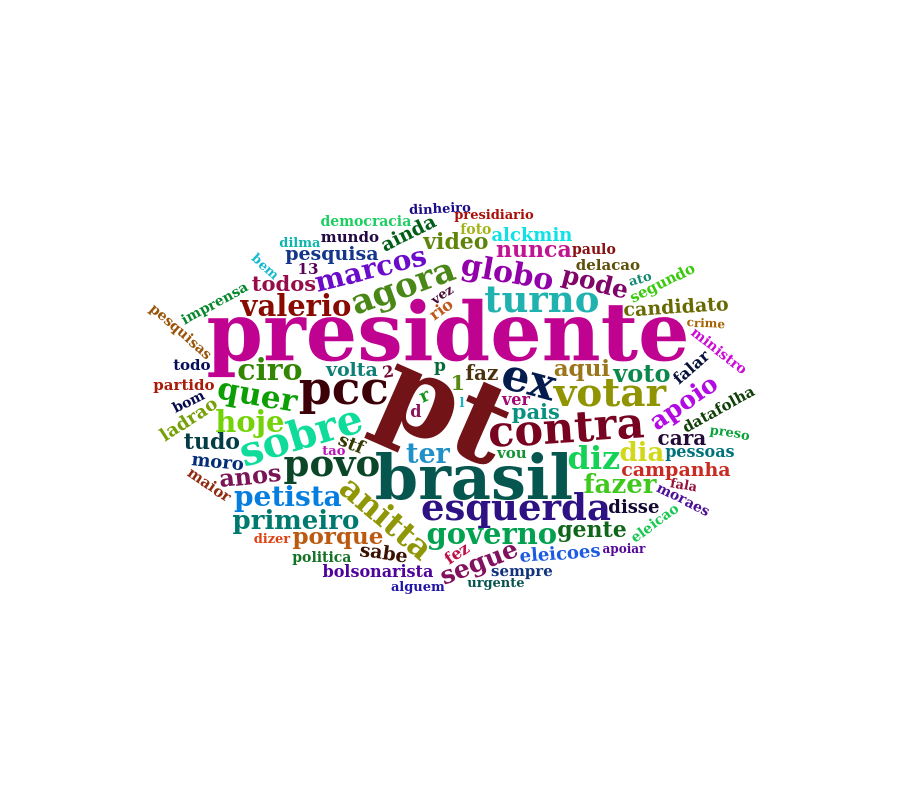
```
</center>

:::

::: {.panel}

#### Ciro {.panel-name}

<center>
```{r echo = FALSE, out.width = "80%", fig.cap = "Nuvem de Palavras do Ciro"}
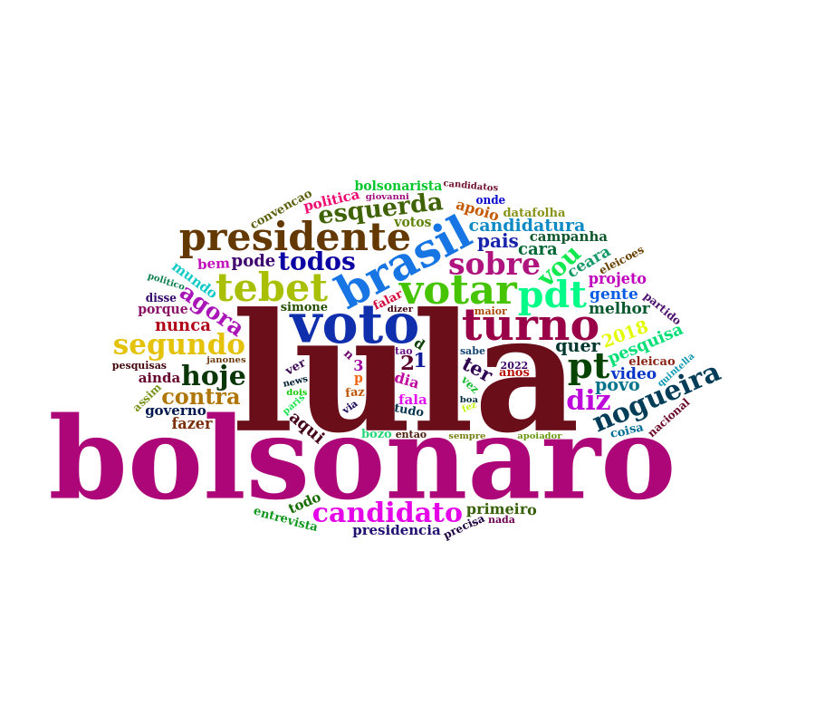
```
</center>

:::

:::::


Ao analisar as nuvens, compartilhamos a primeira impressão de cada uma:

- **Bolsonaro:** em primeiro plano se consolidam as palavras “Lula” e “Brasil” (mantendo a mesma estrutura do mês anterior). Em segundo plano, “governo’’ “contra”, “sobre”, “povo” e “pt”
- **Lula:** em primeiro plano aparecem “PT”, “presidente” e “Brasil” (mantendo a mesma estrutura do mês anterior); em segundo plano “ex”, “votar”, “contra”, “pcc”, “esquerda” e “povo”.
- **Ciro:** a tendência dos últimos meses se manteve em primeiro plano (“Lula” e “Bolsonaro)”. Já em segundo plano, “voto”, “turno” e “Tebet” ( em menção à candidata pelo MDB). 


### Análise de sentimentos


O sentimento de cada tuíte foi construído através da identificação dos sentimentos das unidades básicas (as palavras) utilizando os dicionários `oplexicon v3.0` e `sentilex`, do pacote `lexiconPT`. Assim, cada palavra encontrada nos dicionários recebe a nota 1, -1 ou 0, a depender de se o sentimento for positivo, negativo ou neutro, respectivamente. Palavras não encontradas nos dicionários recebem também nota 0. Os valores atribuídos a cada palavra dentro do tuíte foram somados, e a depender do resultado positivo, negativo ou zero, o sentimento do tuíte é classificado como positivo, negativo ou neutro. Na Figura 9 são apresentados os sentimentos (Negativo, Neutro e Positivo) percentualmente por candidato. Esse é um retrato, um instantâneo sentimental no mês de julho e pode-se observar que, proporcional ao número de tuítes mencionando cada candidato, Ciro teve a menor porcentagem de tuítes com sentimento negativo e maior porcentagem de tuítes com sentimentos positivos e neutros. Já o candidato Lula teve a maior porcentagem de tuítes negativos e a menor porcentagem de tuítes positivos. Bolsonaro teve a menor porcentagem de tuítes neutros.


<center>
```{r echo = FALSE, out.width = "85%", fig.cap = "Sentimentos dos tuítes por candidato"}
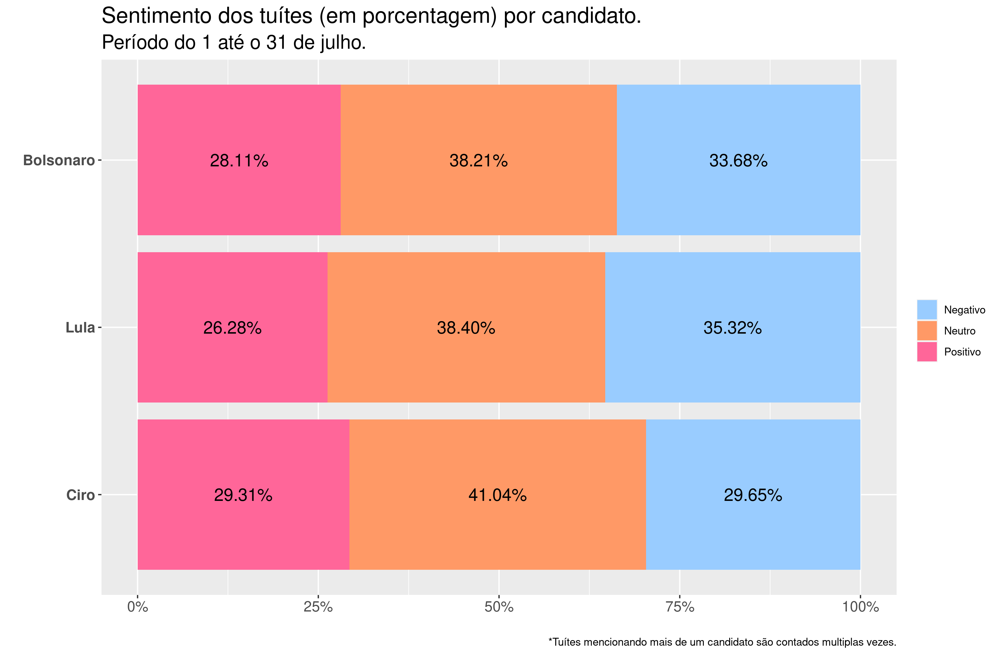
```
</center>


A seguir, é possível observar a nuvem de palavras de cada um dos candidatos, apresentadas em separado, segundo os sentimentos atribuídos a cada tuíte. Palavras em rosa aparecem nos tuítes classificados como associados a sentimentos positivos, palavras em azul aparecem nos tuítes classificados como associados a sentimentos negativos, e palavras em laranja aparecem nos tuítes classificados como neutros.


<aside>
As nuvens de palavras com sentimentos consideram as 200 palavras mais frequentes.
</aside>


::::: {.panelset}

::: {.panel}

#### Bolsonaro {.panel-name}

<center>
```{r echo = FALSE, out.width = "100%", fig.cap = "Nuvem de Palavras do Bolsonaro com sentimentos."}
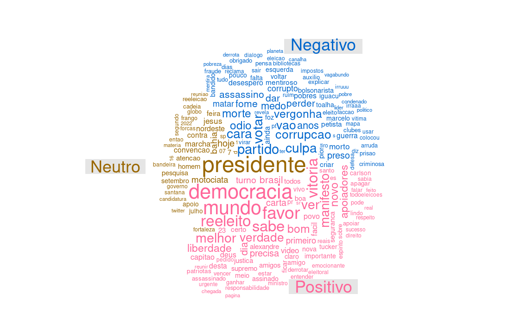
```
</center>

:::

::: {.panel}

#### Lula {.panel-name}

<center>
```{r echo = FALSE, out.width = "100%", , fig.cap = "Nuvem de Palavras do Lula com sentimentos."}
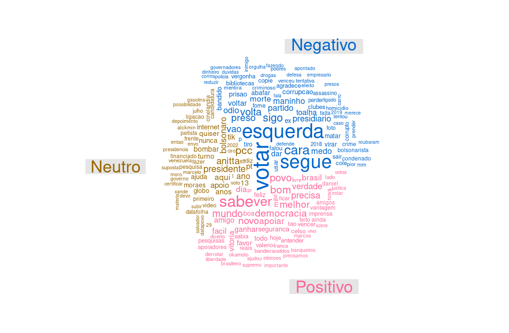
```
</center>

:::

::: {.panel}

#### Ciro {.panel-name}

<center>
```{r echo = FALSE, out.width = "100%", fig.cap = "Nuvem de Palavras do Ciro com sentimentos."}
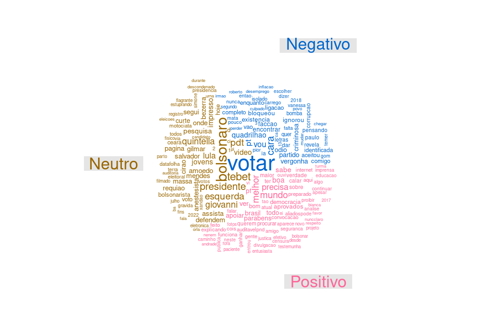
```
</center>

:::

:::::


- **Bolsonaro:** Os tuítes relacionados ao candidato Bolsonaro que foram classificados como associados a sentimentos positivos estão caracterizados por palavras como “democracia”, “mundo” e “reeleito”. Já os tuítes classificados como associados a sentimentos negativos são caracterizados por palavras como “partido”, “culpa”, “corrupção”. Por último, tuítes considerados neutros trazem em destaque a palavra “presidente”.
- **Lula:** Os tuítes relacionados ao candidato Lula que foram classificados como associados a sentimentos positivos estão caracterizados por palavras como “sabe”, “ver”, “bom” e “povo”. Já os tuítes classificados como negativos estão caracterizados por palavras como “votar”, “esquerda”, “segue”. Por último, os tuítes com sentimento neutro estão caracterizados principalmente pelo nome “PCC”, “Anitta” e “presidente”.
- **Ciro:** Os tuítes relacionados ao candidato Ciro que foram classificados como associados a sentimentos positivos estão caracterizados por palavras como “melhor”, “mundo” e “precisa”. Já os tuítes classificados como negativos estão caracterizados por palavras como “votar”. Por último, os tuítes com sentimento neutro estão caracterizados por palavras como “Bolsonaro”, “Tebet” e “presidente”.


## Bigramas

<aside>
Bigramas são pares de palavras que aparecem conjuntamente ao longo dos tuítes.
</aside>

Os 25 bigramas mais frequentes nos tuítes mencionando cada um dos candidatos são apresentados nas Figuras 13 – 15. A direção da seta revela a ordem em que o bigrama aparece e quanto maior a intensidade da seta, maior a frequência do bigrama.


::::: {.panelset}

::: {.panel}

#### Bolsonaro {.panel-name}

<center>
```{r echo = FALSE, out.width = "100%", fig.cap = "Bigramas do Bolsonaro."}
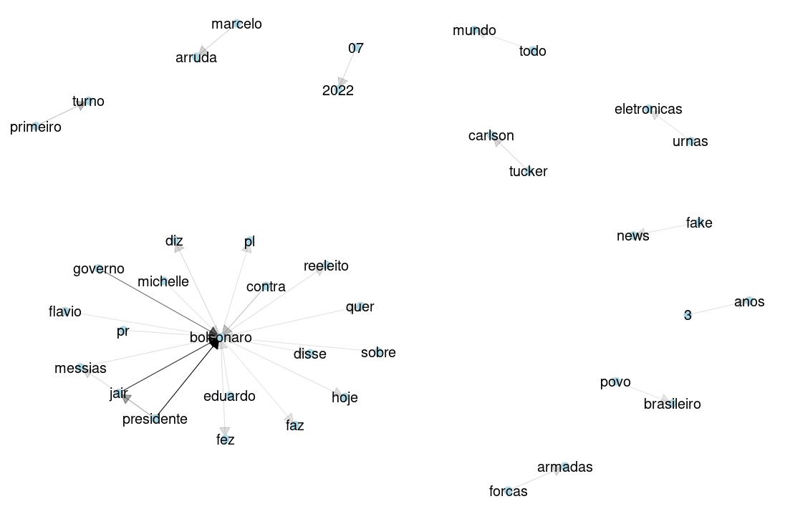
```
</center>

:::

::: {.panel}

#### Lula {.panel-name}

<center>
```{r echo = FALSE, out.width = "100%", fig.cap = "Bigramas do Lula."}
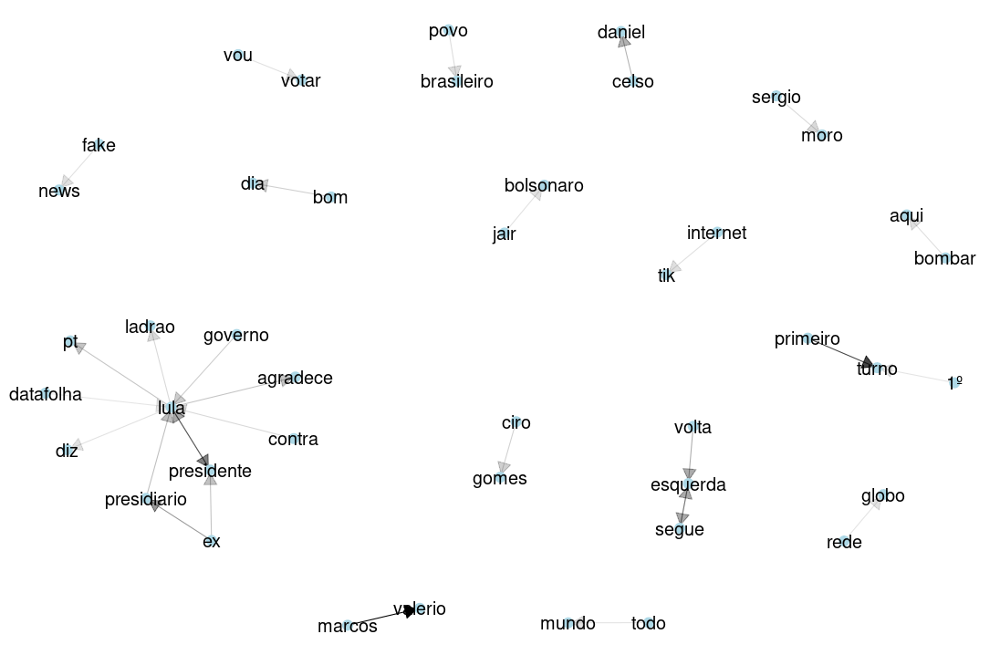
```
</center>

:::

::: {.panel}

#### Ciro {.panel-name}

<center>
```{r echo = FALSE, out.width = "100%", fig.cap = "Bigramas do Ciro."}
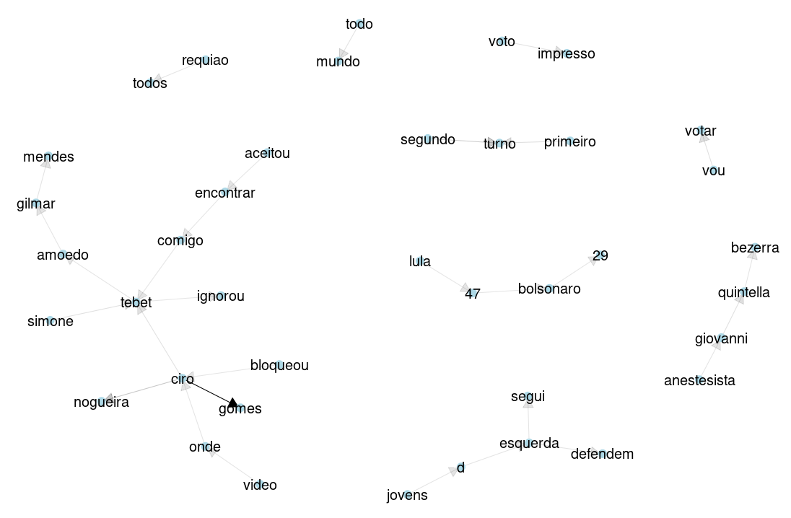
```
</center>

:::

:::::


$\rightarrow$

- **Bolsonaro:** entre os bigramas mais frequentes temos “governo $\rightarrow$ Bolsonaro", “Jair $\rightarrow$ Bolsonaro” e “presidente $\rightarrow$ Bolsonaro”. Seguido a estes temos “Michelle $\rightarrow$ Bolsonaro” (o que pode indicar o recente apelo à atuação da primeira dama como estratégia para alcançar o público feminino e de evangélicos na campanha), “urnas $\rightarrow$ eletrônicas", “Eduardo $\rightarrow$ Bolsonaro”, “fake $\rightarrow$ news”, “forças $\rightarrow$ armadas”, “Marcelo $\rightarrow$ Arruda”, “primeiro $\rightarrow$ turno”.
- **Lula:**  entre os bigramas mais frequentes temos “primeiro $\rightarrow$ turno”, “Marcos $\rightarrow$ Valerio” e “Lula $\rightarrow$ presidente”, seguido por “volta $\rightarrow$ esquerda”, “esquerda $\rightarrow$ segue”, “ex $\rightarrow$ presidiário”, “povo $\rightarrow$ brasileiro”, “vou $\rightarrow$ votar” e “Celso $\rightarrow$ Daniel”. Com uma menor intensidade “rede $\rightarrow$ globo”, “Jair $\rightarrow$ Bolsonaro”, “Sergio $\rightarrow$ Moro” e “fake $\rightarrow$ news”
- **Ciro:** entre os bigramas mais frequentes temos, predominantemente, “Ciro $\rightarrow$ Gomes”. Entre outros bigramas, porém com menor intensidade, temos “Ciro $\rightarrow$ bloqueou”, “Ciro $\rightarrow$ Tebet”, “Tebet $\rightarrow$ ignorou”, “Tebet $\rightarrow$ comigo”, “encontrar $\rightarrow$ aceitou” e “voto $\rightarrow$ impresso”


## Comentários finais

A apresentação desse conjunto de dados visa contribuir para interpretações sobre a movimentação no Twitter dos possíveis candidatos nas eleições de 2022, bem como sobre o que se fala a seu respeito nas interações dos usuários da plataforma ao longo do mês de julho. Esse é um trabalho de pesquisa em andamento e será aperfeiçoado no transcorrer dos meses até a eleição de 2022.

Aqui pode lêr na integra as análises dos meses de [abril](https://twitterpolitico2022.github.io/posts/2022-05-02-abril-dos-presidenciveis-no-twitter/),  [maio](https://twitterpolitico2022.github.io/posts/2022-06-15-maio-dos-presidenciveis-no-twitter/) e [junho](https://twitterpolitico2022.github.io/posts/2022-07-19-junho-dos-presidenciveis-no-twitter/).

> Pesquisadores(as) do [IPPUR/UFRJ](https://ippur.ufrj.br/) tem um boletim sobre política nas redes [aqui.](https://politicanasredes.com/)


