## Como os dados foram extraídos

Para cada candidato, foram coletados tuítes referentes a cada um dos 31 dias do mês de agosto, totalizando mais de 26 milhões de tuítes, o maior volume mensal obtido desde o início da pesquisa. Este aumento coincide com o início do período da propaganda eleitoral, ocorrido no dia 16 de agosto de 2022. Os dados foram extraídos através de uma API do twitter utilizada exclusivamente para fins acadêmicos e analisados utilizando o software R.


<aside>
Os autores agradecem ao Twitter pelas contas acadêmicas a eles concedidas.
</aside>

## Número de seguidores

A seguir, apresentamos o número atualizado (agosto em relação a julho, dados de 11 de outubro de 2022) de seguidores no Twitter de cada um dos candidatos.

- **Bolsonaro** - de 8,6 milhões para 9,2 milhões (acréscimo de aproximadamente 7% de seguidores em relação ao mês anterior)
- **Lula** - de  4 milhões para 4,8 milhões (acréscimo de aproximadamente 20% de seguidores em relação ao mês anterior)
- **Ciro** -  de 1,4 milhões para 1,5 milhões (acréscimo de aproximadamente 7% de seguidores em relação ao mês anterior)


## Tuítes dos candidatos

Na Figura 1 abaixo, apresentamos um gráfico com o número de tuítes da timeline dos candidatos, dentre os três que fazem parte de nosso levantamento: Lula, Ciro e Bolsonaro, de acordo com a frequência com que os candidatos tuitaram no mês de agosto.


<center>
```{r echo = FALSE, out.width = "85%", fig.cap = "Número de tuítes na timeline dos candidatos"}
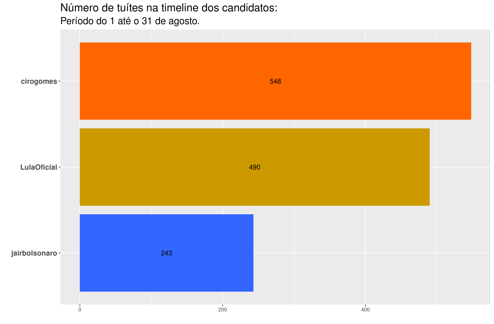
```
</center>

Diferente dos meses de junho e julho, em que o candidato Lula era quem mais tuitava na própria timeline,  o mês de agosto evidencia uma maior interação do candidato Ciro Gomes na rede social. Já o candidato Jair Bolsonaro, continua sendo o que menos tuita na própria timeline, um fenômeno observado desde o início da nossa pesquisa.


As Figuras 2 e 3 apresentam as palavras mais frequentes nos tuítes da timeline dos candidatos, e as palavras mais frequentes nos tuítes da timeline dos candidatos que não foram tão frequentes nos tuítes da timeline dos outros candidatos, respectivamente.


<center>
```{r echo = FALSE, out.width = "100%", fig.cap = "Palavras mais frequentes na timeline dos candidatos"}
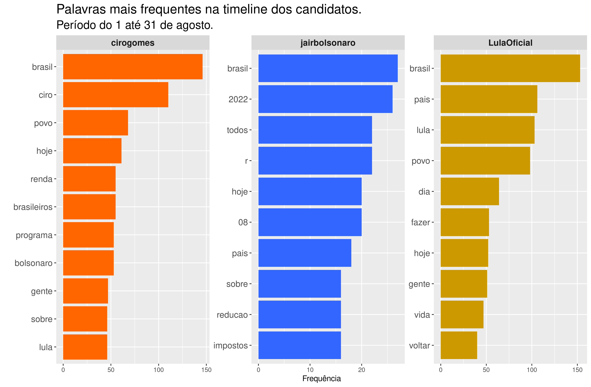
```
</center>

A análise das palavras mais frequentes nos tuítes da timeline dos candidatos (Figura 2) nos permite apresentar um panorama dominante dos assuntos por eles tratados. Em comum nos três perfis encontramos os termos “hoje” e “Brasil”, no caso do segundo, mantendo o padrão encontrado até julho. A diferença surgiu na menção à palavra “hoje” pelos três, além da mudança em relação ao termo “povo”, antes mencionado frequentemente nos três perfis. Embora o termo “povo” tenha destaque em Lula e Ciro, ele é mais frequente no perfil de Lula do que no segundo, e não aparece mais no perfil de Bolsonaro, onde se destaca o termo “todos”. Nos perfis de Lula e Ciro, em comum os termos “Lula”, “hoje” e “gente”.  No perfil de Lula isoladamente, o destaque para os verbos “fazer” e “voltar” e os substantivos “dia” e “vida”, o que denota uma continuidade do caráter propositivo encontrado até julho, com a novidade do termo “vida”, que traz ênfase à construção propositiva. No perfil de Ciro, se mantém a preocupação em mencionar nominalmente os outros dois candidatos, como observado desde abril. É possível destacar no consolidado do mês de agosto, as menções aos termos “renda”, “programa” e “brasileiros”. Por fim, no perfil de Bolsonaro é possível identificar que se mantém a menção a valores em reais (“r” ), “2022”, “08” e “redução”, o que se consolida no sentido das menções observadas do termo “impostos”, novidade em relação ao mês de julho, que confirma nossa intuição do mês anterior de que a redução se referiu ao tema.


<center>
```{r echo = FALSE, out.width = "100%", fig.cap = "TF-IDF da timeline dos candidados"}
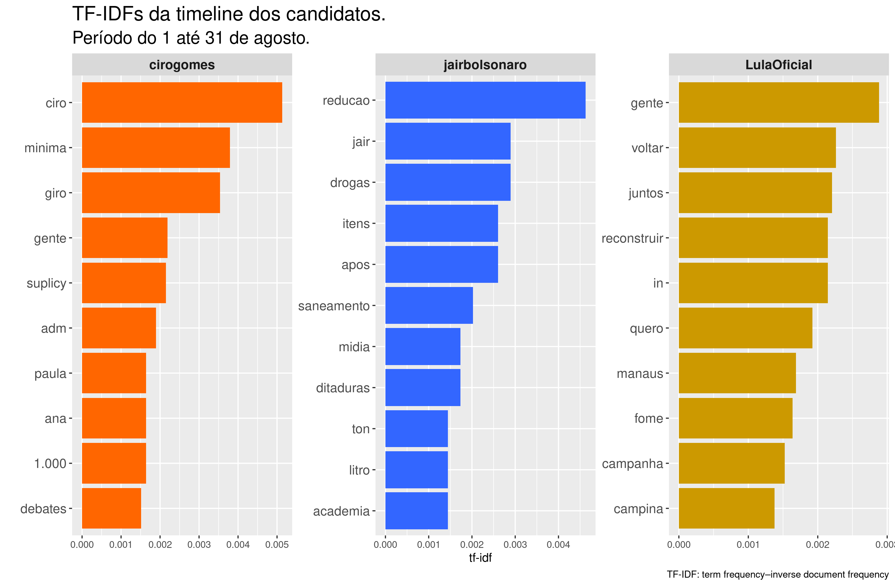
```
</center>

Na Figura 3, TF-IDF (term frequency-inverse document frequency) reflete a frequência das palavras nos tuites da timeline dos candidatos, que não são tão frequentes para os três candidatos em geral. Assim:

- No perfil de Lula, a novidade em julho está nos termos “gente”, “voltar”, “quero”, “Manaus”, “campanha” e “Campina” ( Manaus e Campina são regiões que receberam  visita do candidato em campanha). A ênfase que se manteve em relação a junho e julho foi o tema da “fome”, “reconstruir”e o “juntos” . 
- O perfil de Bolsonaro repete os termos “redução” e “drogas”, em relação ao encontrado em julho. A novidade aparece nos termos “Jair”, “itens”, “após”, “saneamento”, “mídia”, “ditaduras”, “ton”, “litro” ( da gasolina)  e “academia”.  
- No perfil de Ciro se mantém as menções às palavras “Ciro” e “giro”. As demais que surgiram em agosto foram “mínima”, “gente”, “Suplicy”, “adm”, “Paula”, “Ana”, “ 1.000” e “debates” ( A menção à Ana Paula Matos se refere à vice em sua chapa).


## Tuítes sobre os candidatos


Na sequência, na Figura 4, apresentamos em ordem decrescente (do mais citado ao menos citado), o total de tuítes que mencionaram o nome de cada candidato pesquisado no mês de julho: Bolsonaro, Lula e Ciro.


<aside>
Para coletar os tuites mencionando os respectivos candidatos, foram utilizados como critério de busca as palavras "Bolsonaro", "Ciro" e "Lula". Tuítes mencionando "Ciro Nogueira" foram excluidos das análises referentes ao candidato Ciro.
</aside>

<center>
```{r echo = FALSE, out.width = "85%", fig.cap = "Total de tuítes sobre os candidatos"}
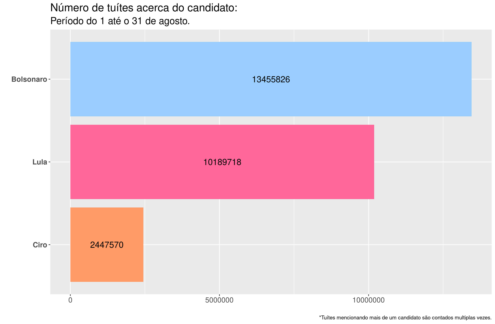
```
</center>


O volume de tuítes acerca dos candidatos continua na mesma ordem observada nos meses anteriores: Bolsonaro, Lula e, por último, Ciro. Contudo, o aumento no volume de interações dos usuários mencionando cada um dos candidatos incrementou expressivamente em todos os casos: 

- A quantidade de tuítes mencionando Bolsonaro foi de 8.351.515 para 13.455.826, representando um aumento de 61% a respeito do mês anterior.
- A quantidade de tuítes mencionando Lula foi de 5.663.521 para 10.189.718, representando um aumento de 79% a respeito do mês anterior.
- Por último, a quantidade de tuítes mencionando Ciro foi de 726.072 para 2.447.570, representando um aumento de  237% a respeito do mês anterior.


A evolução diária dos tuítes mencionando cada candidato apresenta-se na Figura 5. Entre os maiores destaques, observa-se o aumento expressivo do Ciro Gomes na última semana de agosto.  Outro destaque é o aumento expressivo na quantidade de tuítes envolvendo o candidato Lula, chegando a ultrapassar, e por muito, a quantidade de tuítes mencionando o candidato Bolsonaro nos dias 25 e 26 de agosto. Estes dias correspondem ao dia da entrevista do candidato no Jornal Nacional, da Rede Globo de Televisão. 

O primeiro pico observado na evolução diária dos tuítes mencionando Bolsonaro foi no dia 22 de agosto, dia em que o candidato participou da entrevista no Jornal Nacional.
Por último, o aumento de tuítes mencionando os três candidatos ocorrido no dia 28 de agosto deve-se ao debate presidencial transmitido pela Rede Bandeirantes de Televisão. 


 


<center>
```{r echo = FALSE, out.width = "85%", fig.cap = "Evolução diária da quantitate de tuítes sobre os candidatos"}
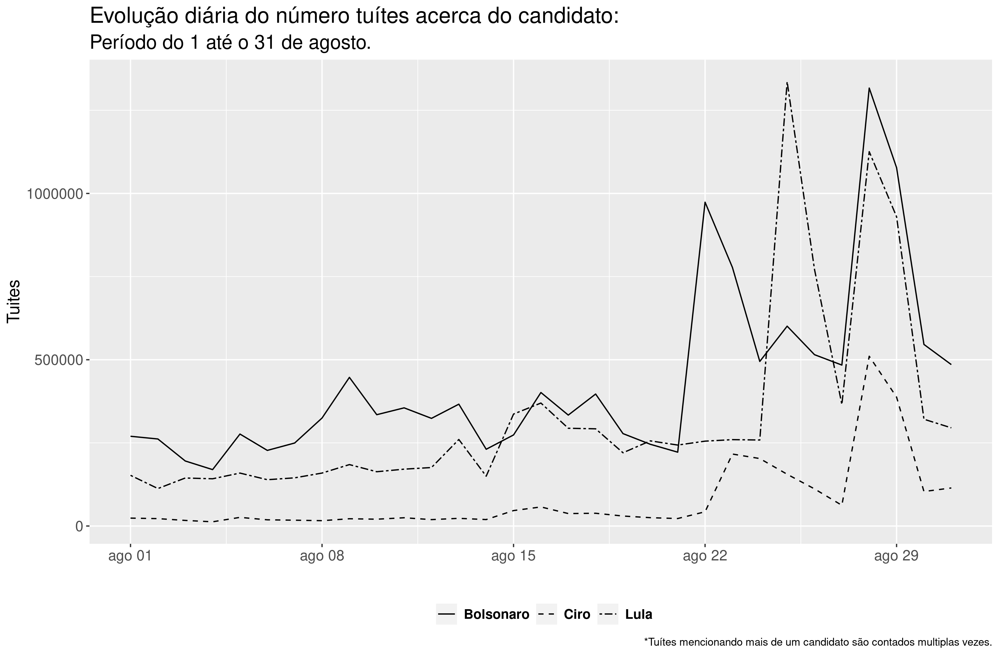
```
</center>


### Nuvem de palavras


<aside>
Uma nuvem de palavras é uma representação gráfica das palavras mais frequentes dentro de um texto ou conjunto de textos. 
</aside>


Uma nuvem de palavras é uma representação gráfica das palavras mais frequentes dentro de um texto ou conjunto de textos.

A seguir, apresentamos três nuvens de palavras, onde cada uma corresponde a um candidato. É importante sinalizar que o nome de cada candidato foi retirado da sua própria nuvem, para melhor visualização das palavras associadas. Cabe ressaltar também, que cada nuvem reflete as 100 palavras mais relevantes associadas, excluídas stop words, a cada candidato nas interações dos usuários do Twitter nos trinta e um dias do mês de agosto.


_Clique no nome do candidato para ver a respectiva nuvem de palavras._

<aside>
Em análise de texto, _stop words_ são palavras bastante comuns tais como "e", "de", "o", etc. Essas palavras não são úteis para as análises e costumam ser removidas antes das análises.
</aside>


```{r panelset, layout='l-page', echo=FALSE}
xaringanExtra::use_panelset()
xaringanExtra::style_panelset_tabs(foreground = "honeydew", background = "#0F2E3D")
```

::::: {.panelset}

::: {.panel}

#### Bolsonaro {.panel-name}

<center>
```{r echo = FALSE, out.width = "70%", fig.cap = "Nuvem de Palavras do Bolsonaro"}
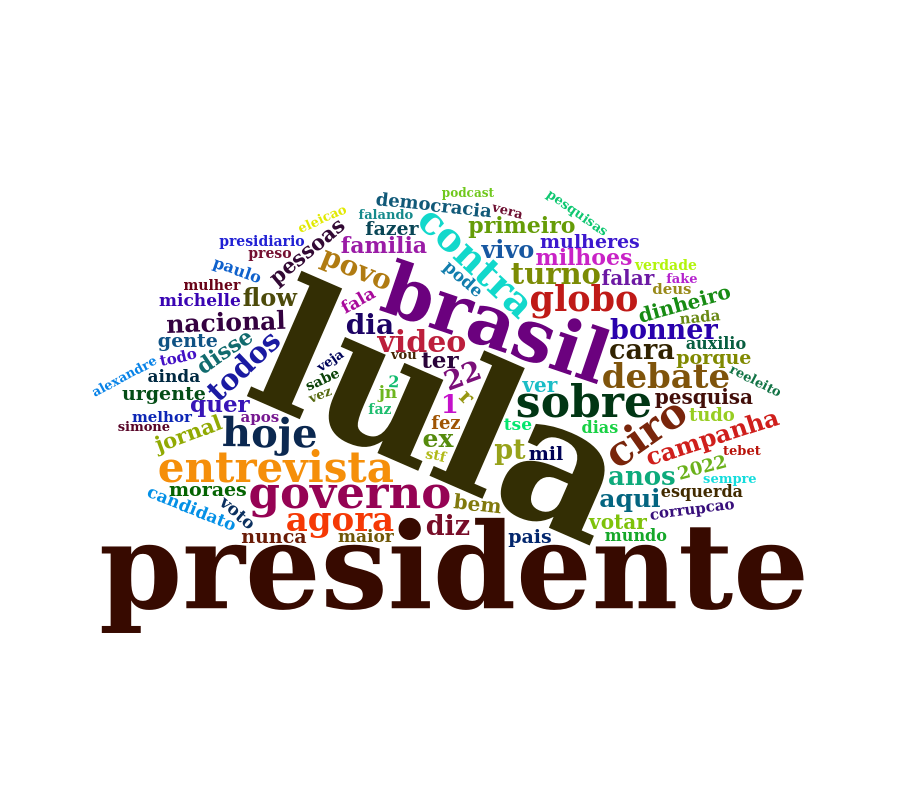
```
</center>

:::

::: {.panel}

#### Lula {.panel-name}

<center>
```{r echo = FALSE, out.width = "90%", fig.cap = "Nuvem de Palavras do Lula"}
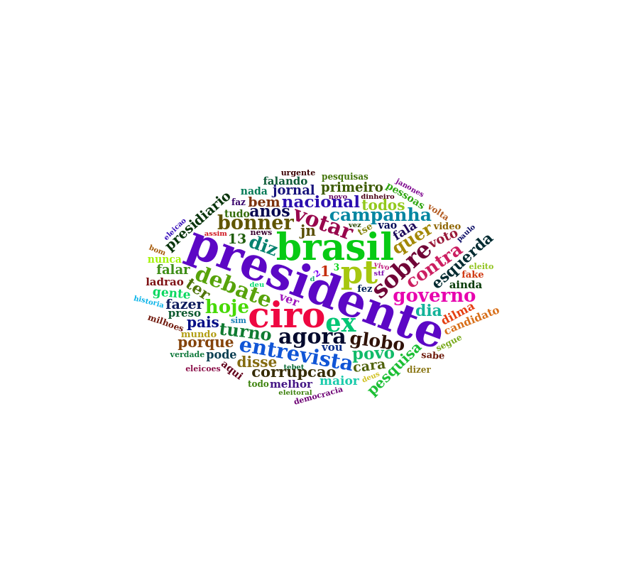
```
</center>

:::

::: {.panel}

#### Ciro {.panel-name}

<center>
```{r echo = FALSE, out.width = "80%", fig.cap = "Nuvem de Palavras do Ciro"}
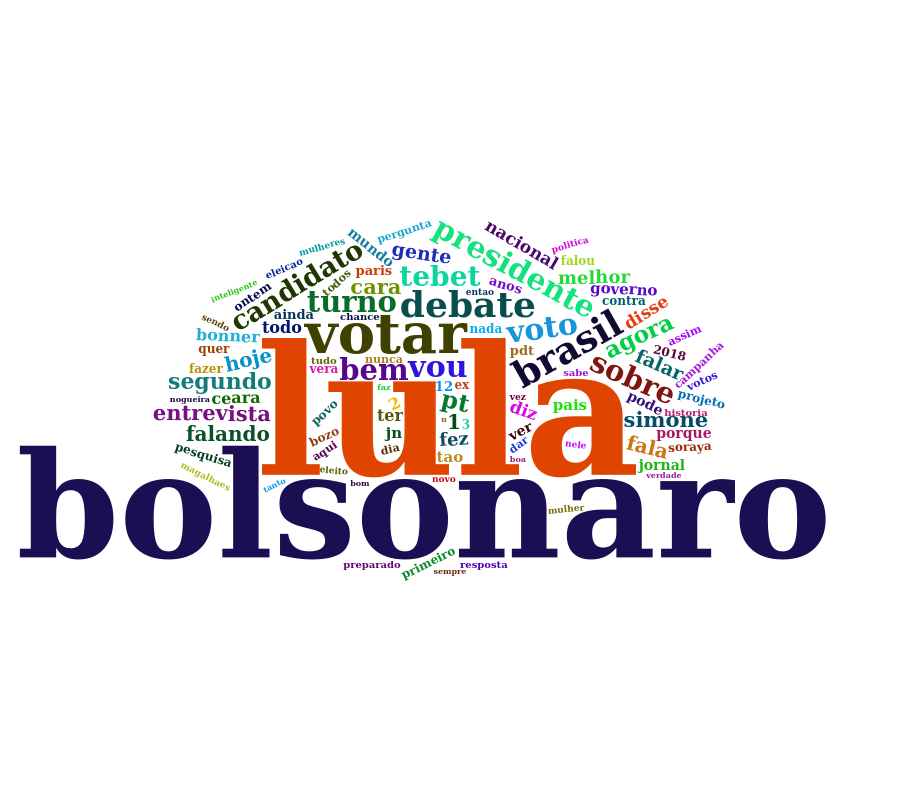
```
</center>

:::

:::::


Ao analisar as nuvens, compartilhamos a primeira impressão de cada uma:

- **Bolsonaro:** há uma mudança no primeiro plano. Onde antes aparecia “Brasil”, vemos agora “Lula” em grande destaque, seguido em menor grandeza por “presidente”, “entrevista”, “governo”, “globo” e “sobre”.
- **Lula:** em primeiro plano aparecem “presidente”, seguido por “Brasil”, “Ciro” e “PT”; em segundo plano “ex”, “votar”, “agora”, “entrevista”, “sobre” e “debate”.
- **Ciro:** a tendência dos últimos meses se manteve em primeiro plano “Lula” e “Bolsonaro”, agora o primeiro aparece ainda maior em relação ao segundo. Já em segundo plano aparece “votar”, seguido por, “debate”, “brasil”, “presidente” e “Tebet” ( a última em menção à também candidata pelo MDB, Simone Tebet).


### Análise de sentimentos


O sentimento de cada tuíte foi construído através da identificação dos sentimentos das unidades básicas (as palavras) utilizando os dicionários oplexicon v3.0 e sentilex, do pacote lexiconPT. Assim, cada palavra encontrada nos dicionários recebe a nota 1, -1 ou 0, a depender de se o sentimento for positivo, negativo ou neutro, respectivamente. Palavras não encontradas nos dicionários recebem também nota 0. Os valores atribuídos a cada palavra dentro do tuíte foram somados, e a depender do resultado positivo, negativo ou zero, o sentimento do tuíte é classificado como positivo, negativo ou neutro. Na Figura 9 são apresentados os sentimentos (Negativo, Neutro e Positivo) percentualmente por candidato. Esse é um retrato, um instantâneo sentimental no mês de agosto e pode-se observar que, proporcional ao número de tuítes mencionando cada candidato.

O candidato Lula obteve a maior porcentagem  de tuítes com sentimento negativo (32.57%) e o candidato Bolsonaro a maior porcentagem de tuites com sentimento positivo (29.30%). O candidato Ciro apresenta a maior porcentagem de tuites neutros (39.74%). 


<center>
```{r echo = FALSE, out.width = "85%", fig.cap = "Sentimentos dos tuítes por candidato"}
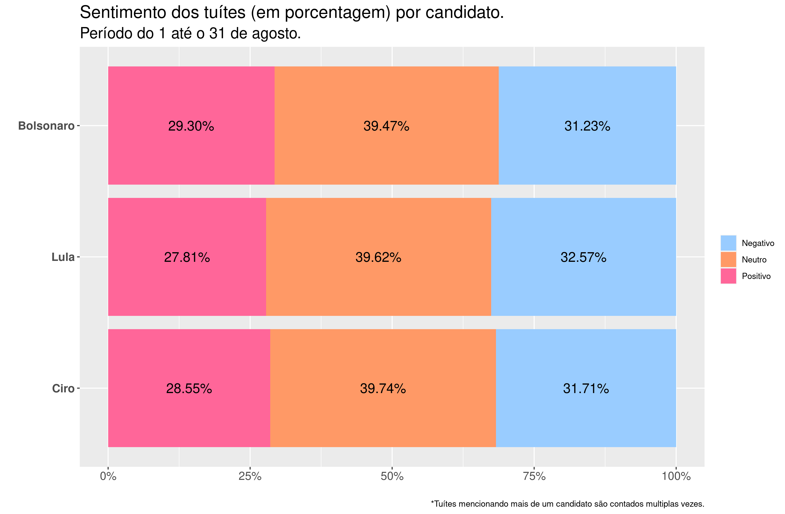
```
</center>


A seguir, é possível observar a nuvem de palavras de cada um dos candidatos, apresentadas em separado, segundo os sentimentos atribuídos a cada tuíte. Palavras em rosa aparecem nos tuítes classificados como associados a sentimentos positivos, palavras em azul aparecem nos tuítes classificados como associados a sentimentos negativos, e palavras em bege aparecem nos tuítes classificados como neutros.

<aside>
As nuvens de palavras com sentimentos consideram as 200 palavras mais frequentes.
</aside>


::::: {.panelset}

::: {.panel}

#### Bolsonaro {.panel-name}

<center>
```{r echo = FALSE, out.width = "100%", fig.cap = "Nuvem de Palavras do Bolsonaro com sentimentos."}
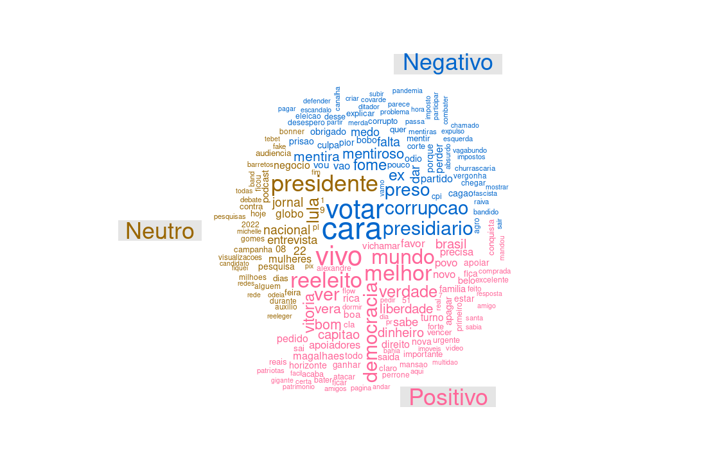
```
</center>

:::

::: {.panel}

#### Lula {.panel-name}

<center>
```{r echo = FALSE, out.width = "100%", , fig.cap = "Nuvem de Palavras do Lula com sentimentos."}
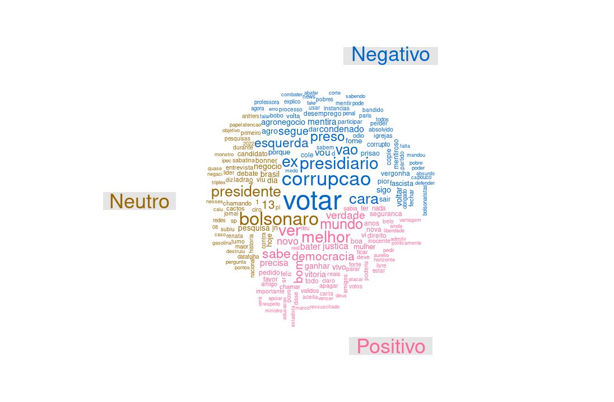
```
</center>

:::

::: {.panel}

#### Ciro {.panel-name}

<center>
```{r echo = FALSE, out.width = "100%", fig.cap = "Nuvem de Palavras do Ciro com sentimentos."}
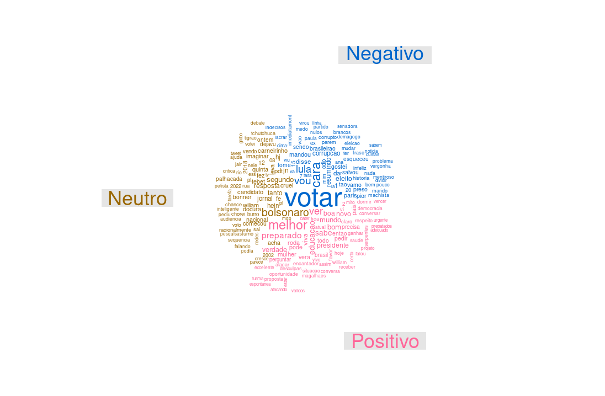
```
</center>

:::

:::::


- **Bolsonaro:** Os tuítes relacionados ao candidato Bolsonaro que foram classificados como associados a sentimentos positivos estão caracterizados por palavras como “vivo”, “reeleito”, “mundo” e “melhor”. Já os tuítes classificados como associados a sentimentos negativos são caracterizados por palavras como “votar”, “cara”, “corrupção” e “presidiário”. Por último, tuítes considerados neutros trazem em destaque “presidente”, “Lula”, “jornal” e “Globo”.
- **Lula:** Os tuítes relacionados ao candidato Lula que foram classificados como associados a sentimentos positivos estão caracterizados por palavras como “mundo”, “melhor”, “ver” e “verdade”. Já os tuítes classificados como negativos estão caracterizados por palavras como “votar”, “corrupção”, “ex” e “presidiário”. Por último, os tuítes com sentimento neutro estão caracterizados principalmente pelos termos “13”, “presidente” e “Bolsonaro”.
- **Ciro:** Os tuítes relacionados ao candidato Ciro que foram classificados como associados a sentimentos positivos estão caracterizados por palavras como “melhor”, “preparado”, “ver” e “educação. Já os tuítes classificados como negativos estão caracterizados por palavras como “votar”, “vou”, “Lula” e “cara”. Por último, os tuítes com sentimento neutro estão caracterizados por palavras como “Bolsonaro”, “cruel” e “jornal”.


## Comentários finais

A apresentação desse conjunto de dados visa contribuir para interpretações sobre a movimentação no Twitter dos principais candidatos segundo as pesquisas de intenção de voto nas eleições de 2022, bem como sobre o que se fala a seu respeito nas interações dos usuários da plataforma ao longo do mês de agosto. Esse é um trabalho de pesquisa em andamento e será aperfeiçoado no transcorrer dos meses até a eleição de 2022.

Aqui você pode ler na íntegra as análises dos meses de  [abril](https://twitterpolitico2022.github.io/posts/2022-05-02-abril-dos-presidenciveis-no-twitter/),  [maio](https://twitterpolitico2022.github.io/posts/2022-06-15-maio-dos-presidenciveis-no-twitter/), [junho](https://twitterpolitico2022.github.io/posts/2022-07-19-junho-dos-presidenciveis-no-twitter/) e [julho.](https://twitterpolitico2022.github.io/posts/2022-08-19-julho-dos-presidenciveis-no-twitter/)

> Pesquisadores(as) do [IPPUR/UFRJ](https://ippur.ufrj.br/) tem um boletim sobre política nas redes [aqui.](https://politicanasredes.com/)


