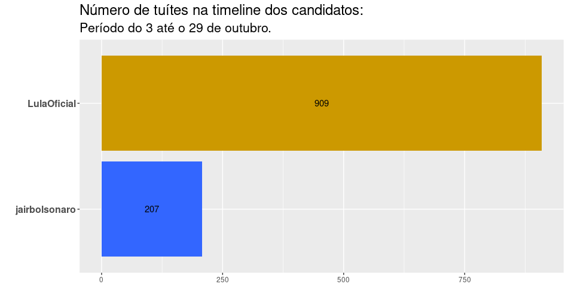
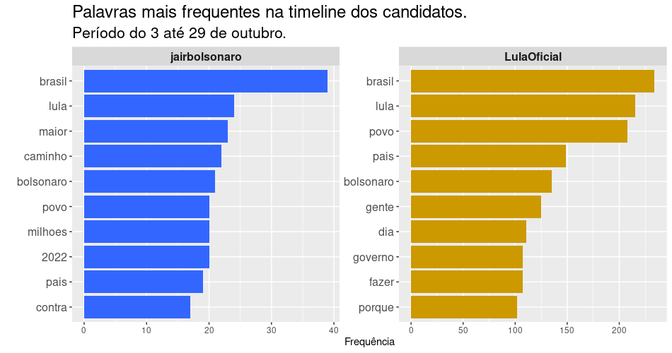
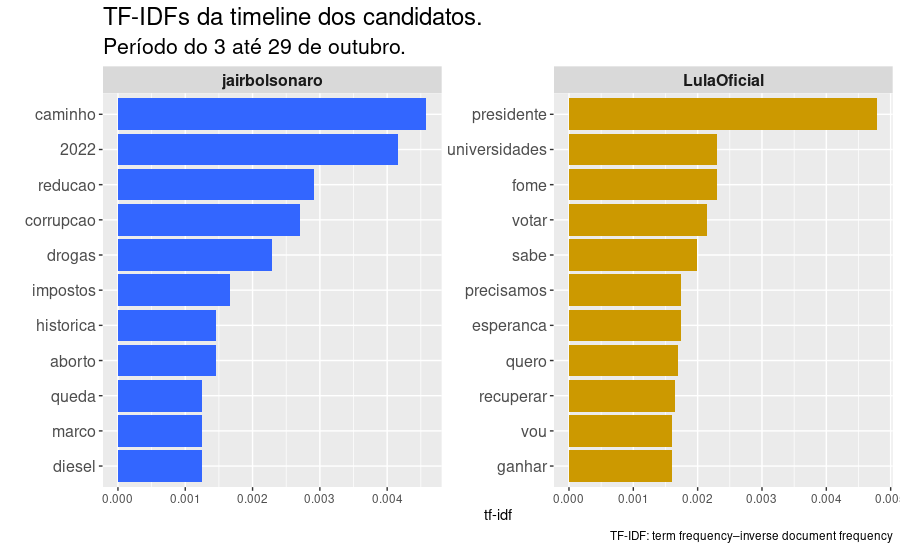
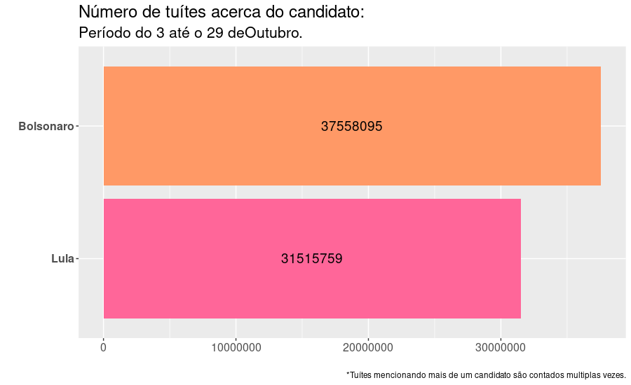
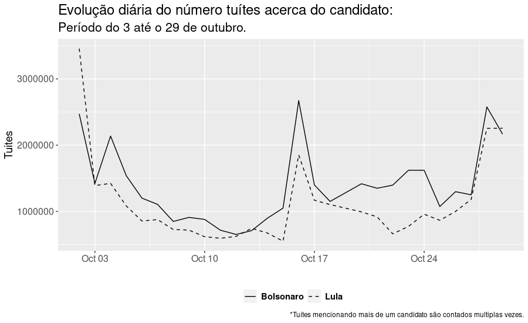
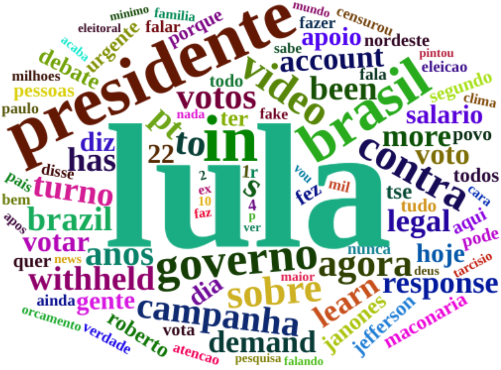
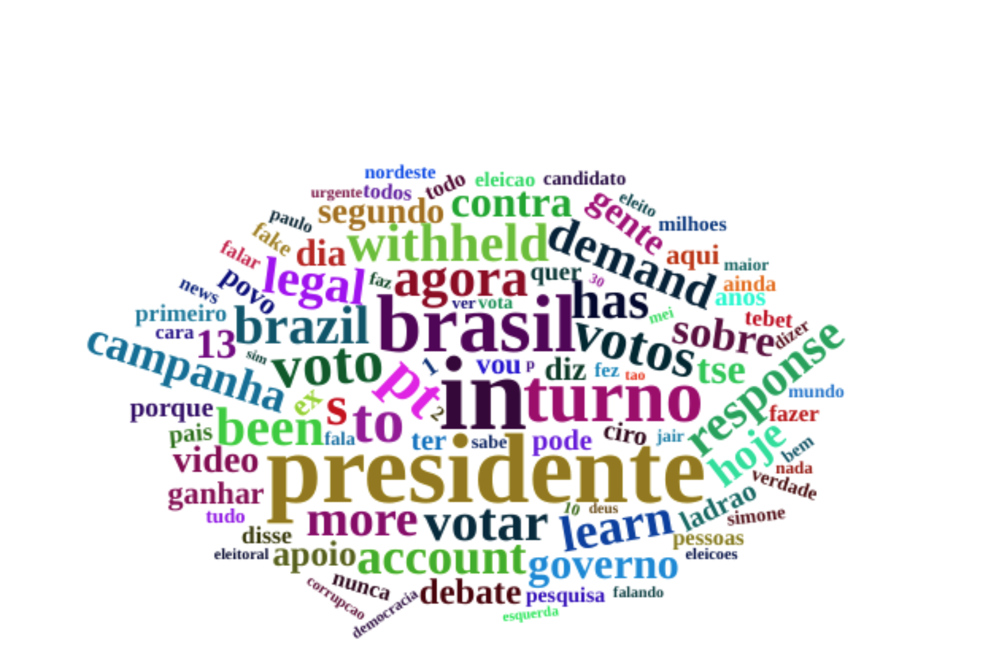
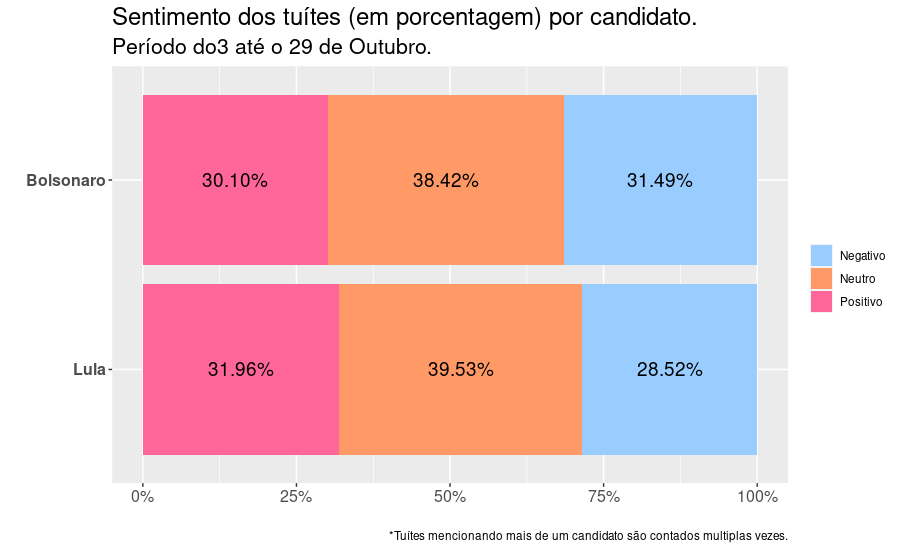
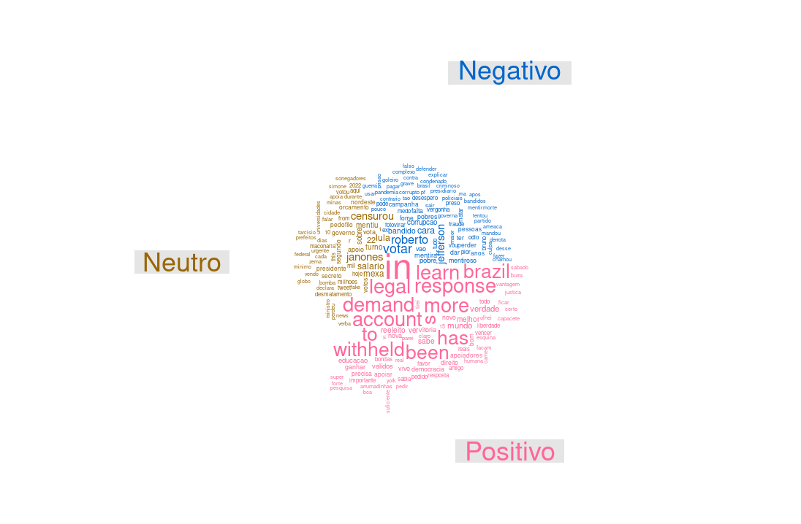
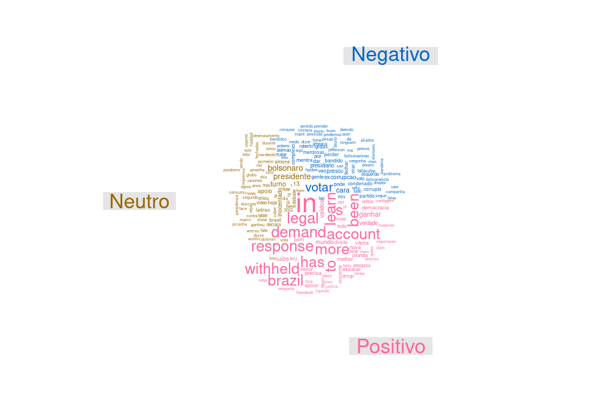

## Como os dados foram extraídos

Para cada candidato, foram coletados tuítes referentes a cada um dos dias compreendidos entre 03 de outubro de 2022 ( dia seguinte às eleições do segundo turno no Brasil) até dia 29 de outubro do mesmo ano, totalizando mais de 69 milhões de tuítes, o maior volume mensal obtido desde o início da pesquisa, o que demandou maior tempo ao processamento e download dos dados obtidos. Os dados foram extraídos através de uma API do twitter utilizada exclusivamente para fins acadêmicos e analisados utilizando o software R.


<aside>
Os autores agradecem ao Twitter pelas contas acadêmicas a eles concedidas.
</aside>


## Número de seguidores

A seguir, apresentamos o número atualizado ( em relação a setembro de 2022, cujos resultados foram fechados em 29 de novembro de 2022) de seguidores no Twitter de cada um dos candidatos.

- **Bolsonaro:** de 10,5 milhões para 11,2 milhões (acréscimo de aproximadamente 6,7% de seguidores em relação ao mês de novembro de 2022)
- **Lula:** de 6,3 milhões para 7,5 milhões (acréscimo de aproximadamente de 19% de seguidores em relação ao mês de novembro de 2022)


## Tuítes dos candidatos

Na Figura 1 abaixo, apresentamos um gráfico com o número de tuítes da timeline dos candidatos, dentre os três que fazem parte de nosso levantamento: Lula e Bolsonaro, de acordo com a frequência com que os candidatos tuitaram no mês de outubro.


<center>
```{r echo = FALSE, out.width = "85%", fig.cap = "Número de tuítes na timeline dos candidatos"}

```
</center>


Pela primeira vez observamos uma considerável distância entre os percentuais de  posicionamento na rede social pelos candidatos. Lula da Silva aumentou sua atividade de forma considerável e Jair Bolsonaro diminuiu suas interações.

As Figuras 2 e 3 apresentam as palavras mais frequentes nos tuítes da timeline dos candidatos, e as palavras mais frequentes nos tuítes da timeline dos candidatos que não foram tão frequentes nos tuítes da timeline dos outros candidatos, respectivamente.


<center>
```{r echo = FALSE, out.width = "100%", fig.cap = "Palavras mais frequentes na timeline dos candidatos"}

```
</center>


A análise das palavras mais frequentes nos tuítes da timeline dos candidatos (Figura 2) nos permite apresentar um panorama dominante dos assuntos por eles tratados. Em comum nos dois perfis encontramos o termo “povo” que era novidade em setembro e se manteve em outubro, além de “Brasil”, “Lula”, “Bolsonaro” e “país”. No perfil de Bolsonaro isoladamente, aparecem os termos , “maior”, “caminho”, “milhões”, “2022” e “contra”. No perfil de Lula isoladamente, o destaque se manteve para o verbo “fazer”, acompanhado agora pelos termos “gente”, “dia”, “governo” e a conjunção explicativa “porque”.  


<center>
```{r echo = FALSE, out.width = "100%", fig.cap = "TF-IDF da timeline dos candidados"}

```
</center>

A Figura 3, TF-IDF (term frequency-inverse document frequency) reflete a frequência das palavras nos tuites da timeline dos candidatos, que não são tão frequentes para os três candidatos em geral. Assim:

- No perfil de Lula, os destaques são os verbos “votar” e “sabe”, bem como os termos “presidente”, “universidades” e “fome”. 
- O perfil de Bolsonaro não apresenta verbos. Os termos que aparecem são “caminho”, “2022”, “redução”, “corrupção” e “drogas”.  


## Tuítes sobre os candidatos


Na sequência, na Figura 4, apresentamos em ordem decrescente (do mais citado ao menos citado), o total de tuítes que mencionaram o nome de cada candidato pesquisado no mês de outubro: Bolsonaro e Lula.


<aside>
Para coletar os tuítes mencionando os respectivos candidatos, foram utilizados como critério de busca as palavras “Bolsonaro” e “Lula”. 
</aside>

<center>
```{r echo = FALSE, out.width = "85%", fig.cap = "Total de tuítes sobre os candidatos"}

```
</center>


O volume de tuítes acerca dos candidatos mais que dobrou. Para se ter uma ideia, em setembro o número de tuítes mencionando Bolsonaro era de 16.784.820 e o de Lula era de  13.899.696. 

A evolução diária dos tuítes mencionando cada candidato apresenta-se na Figura 5. Podemos observar que apesar de Jair Bolsonaro ter se mantido na dianteira da maior parte do segundo turno, nas interações da rede social, isto não tornou essa vantagem avassaladora, em especial quando consideramos o número de seguidores que é amplamente favorável naquele momento e até os dias atuais ao primeiro quando comparados ao adversário, o então candidato Lula da Silva, depois eleito presidente.


<center>
```{r echo = FALSE, out.width = "85%", fig.cap = "Evolução diária da quantitate de tuítes sobre os candidatos"}

```
</center>


### Nuvem de palavras


<aside>
Uma nuvem de palavras é uma representação gráfica das palavras mais frequentes dentro de um texto ou conjunto de textos. 
</aside>


A seguir, apresentamos duas nuvens de palavras, onde cada uma corresponde a um candidato. É importante sinalizar que o nome de cada candidato foi retirado da sua própria nuvem, para melhor visualização das palavras associadas. Cabe ressaltar também, que cada nuvem reflete as 100 palavras mais relevantes associadas, excluídas stop words, a cada candidato nas interações dos usuários do Twitter do dia 03 ao dia 29 do mês de outubro.
No mês de outubro constatamos uma proeminência de palavras no idioma em inglês, nas nuvens de ambos os candidatos, com maior incidência na do então candidato Lula, posteriormente eleito. Entendemos que esse fenômeno reflete o interesse internacional pelas campanhas na rede social Twitter. 


_Clique no nome do candidato para ver a respectiva nuvem de palavras._

<aside>
Em análise de texto, _stop words_ são palavras bastante comuns tais como "e", "de", "o", etc. Essas palavras não são úteis para as análises e costumam ser removidas antes das análises.
</aside>


```{r panelset, layout='l-page', echo=FALSE}
xaringanExtra::use_panelset()
xaringanExtra::style_panelset_tabs(foreground = "honeydew", background = "#0F2E3D")
```

::::: {.panelset}

::: {.panel}

#### Bolsonaro {.panel-name}

<center>
```{r echo = FALSE, out.width = "70%", fig.cap = "Nuvem de Palavras do Bolsonaro"}

```
</center>

:::

::: {.panel}

#### Lula {.panel-name}

<center>
```{r echo = FALSE, out.width = "90%", fig.cap = "Nuvem de Palavras do Lula"}

```
</center>

:::


:::::


Ao analisar as nuvens, compartilhamos a primeira impressão de cada uma:

- Bolsonaro: em primeiro plano aparece isoladamente “Lula”. Em segundo plano, temos as palavras “presidente” e “Brasil”. Em seguida “vídeo”, “contra”, “in”, “governo”, “agora”.
- Lula: em primeiro plano vemos “presidente”, “Brasil” e a preposição inglesa “in”. Em segundo plano, as palavras “demand”, “withheld”, “Brazil”, “PT”, “response”, “voto”, “votos”, “turn”, “has”, “account”, “learn”, “more”, “learn”, “legal”.


### Análise de sentimentos


O sentimento de cada tuíte foi construído através da identificação dos sentimentos das unidades básicas (as palavras) utilizando os dicionários oplexicon v3.0 e sentilex, do pacote lexiconPT. Assim, cada palavra encontrada nos dicionários recebe a nota 1, -1 ou 0, a depender de se o sentimento for positivo, negativo ou neutro, respectivamente. Palavras não encontradas nos dicionários recebem também nota 0. Os valores atribuídos a cada palavra dentro do tuíte foram somados, e a depender do resultado positivo, negativo ou zero, o sentimento do tuíte é classificado como positivo, negativo ou neutro. Na Figura 9 são apresentados os sentimentos (Negativo, Neutro e Positivo) percentualmente por candidato. Esse é um retrato, um instantâneo sentimental do dia 03 ao dia 29 de outubro e pode-se observar que, proporcional ao número de tuítes mencionando cada candidato.


Pode-se observar que o candidato Lula obteve maior porcentagem dos sentimentos positivos e neutros em comparação ao candidato Jair Bolsonaro, que  obteve a maior porcentagem de tuítes classificados como negativos comparativamente (31.49%).


<center>
```{r echo = FALSE, out.width = "85%", fig.cap = "Sentimentos dos tuítes por candidato"}

```
</center>


A seguir, é possível observar a nuvem de palavras de cada um dos candidatos, apresentadas em separado, segundo os sentimentos atribuídos a cada tuíte. Palavras em rosa aparecem nos tuítes classificados como associados a sentimentos positivos, palavras em azul aparecem nos tuítes classificados como associados a sentimentos negativos, e palavras em bege aparecem nos tuítes classificados como neutros.


<aside>
As nuvens de palavras com sentimentos consideram as 200 palavras mais frequentes.
</aside>


::::: {.panelset}

::: {.panel}

#### Bolsonaro {.panel-name}

<center>
```{r echo = FALSE, out.width = "100%", fig.cap = "Nuvem de Palavras do Bolsonaro com sentimentos."}

```
</center>

:::

::: {.panel}

#### Lula {.panel-name}

<center>
```{r echo = FALSE, out.width = "100%", , fig.cap = "Nuvem de Palavras do Lula com sentimentos."}

```
</center>

:::


:::::


- **Bolsonaro:** Os tuítes relacionados ao candidato Bolsonaro que foram classificados como associados a sentimentos positivos estão caracterizados por palavras como “in”, “learn”, “Brazil”, “responsel”, “deamand”, “account”, “more”, “to”, “withheld”, “has”, “been”. Já os tuítes classificados como associados a sentimentos negativos são caracterizados por palavras como “votar”, “Roberto Jefferson”, “bandido”, “cara”. Por último, tuítes considerados neutros trazem em destaque “mexa”, “salário”, “Janones”, “Lula”, “22”, “censurou”.
- **Lula:** Os tuítes relacionados ao candidato Lula que foram classificados como associados a sentimentos positivos estão caracterizados por palavras como “in”, “learn”, “been”, “legal”, “demand”, “account”, “response”, “more”, “has”, “to”, “withheld”, “Brazil”.  Já os tuítes classificados como negativos estão caracterizados por “votar”, seguido de “corrupção”, “cara” e “presidiário”. Por último, os tuítes com sentimento neutro estão caracterizados principalmente pelos termos “Bolsonaro” e “presidente”, seguido por “turno” e “13”.


## Comentários finais

A apresentação desse conjunto de dados visa contribuir para interpretações sobre a movimentação no Twitter dos principais candidatos segundo as pesquisas de intenção de voto nas eleições de 2022, bem como sobre o que se fala a seu respeito nas interações dos usuários da plataforma ao longo do mês de outubro. Esse é o último boletim sobre as eleições de 2022, parte de um trabalho de pesquisa em andamento e será aperfeiçoado no transcorrer do ano de 2023.

Aqui você pode ler na íntegra as análises dos meses de  [abril](https://twitterpolitico2022.github.io/posts/2022-05-02-abril-dos-presidenciveis-no-twitter/),  [maio](https://twitterpolitico2022.github.io/posts/2022-06-15-maio-dos-presidenciveis-no-twitter/), [junho](https://twitterpolitico2022.github.io/posts/2022-07-19-junho-dos-presidenciveis-no-twitter/), [julho](https://twitterpolitico2022.github.io/posts/2022-08-19-julho-dos-presidenciveis-no-twitter/),
[agosto](https://twitterpolitico2022.github.io/posts/2022-10-11-agosto-dos-presidenciveis-no-twitter/) e
[setembro.](https://twitterpolitico2022.github.io/posts/2022-11-29-setembro-dos-presidenciveis-no-twitter/)

> Pesquisadores(as) do [IPPUR/UFRJ](https://ippur.ufrj.br/) tem um boletim sobre política nas redes [aqui.](https://politicanasredes.com/)


